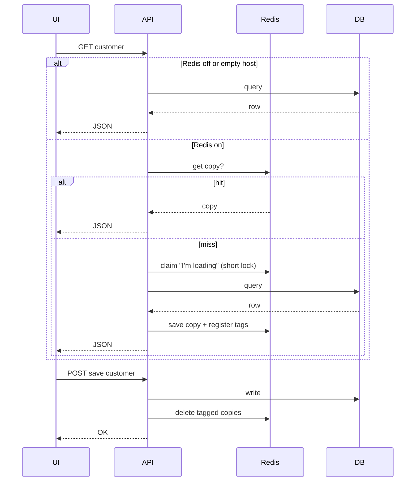

# Redis caching — how to read this doc

- **If you work on UI, QA, or product:** start at **[Part 1 — for UI folks](#part-1--for-ui-qa--product)**. You do not need to know Redis commands.
- **If you write backend code:** use **[Part 3 — for engineers](#part-3--for-engineers)** and the code in `app/redis_cache.py` / `app/customer_registration/customer.py`.

---

# Part 1 — for UI, QA, & product

## What problem does this solve?

The **database** is the source of truth. Reading it on every click can feel slow when many people use the app.

**Redis** (in this project) is an optional **speed layer**: the server can keep a **recent copy** of some **read** responses (mostly customer **detail** and customer **list/filter**) so the UI can get answers faster. It is **not** a second database the UI talks to directly — the **API** still decides everything.

Think of it like a **sticky note on the server’s desk**: “Last time someone asked for customer 42 as an RM, the answer was X.” For a few minutes, the server may answer from the sticky note instead of walking back to the filing cabinet (Postgres) every time.

---

## What you should notice in the product

| You might see… | Roughly why |
|----------------|-------------|
| **Customer detail or list loads quickly** on repeat visits / same filters | A cached copy was reused (good). |
| **Right after save**, detail or list looks **updated** | After **create / edit / deactivate / activate**, the server **throws away** those sticky notes for that customer and for customer lists, then the next load is fresh from the DB. |
| **Very rarely**, something looks **one step behind** for **up to a few minutes** | A copy was still valid on the “sticky note” until it **expires** (target is around **5 minutes**, with small random variation). This is a **trade-off** for speed, not the UI being “wrong” on purpose. |
| **Admin changed someone’s role in the system**, but the **same browser session** still “feels” like the old role for a short time on **cached** reads | Permissions in the **JWT** can change without the **customer row** changing; the sticky note does not know your permissions changed until it **expires** or you **reload** after a new token. **Rare** in normal flows. |

If Redis is **turned off** or not configured, **none** of the above applies — every read hits the database every time (simpler, sometimes slower).

---

## Customer flows (what the backend is doing in plain language)

### Open one customer (detail)

1. First time (or after cache was cleared): server reads from **Postgres**, returns data to the UI, and may **save a copy** in Redis for a few minutes.
2. Next time **same user role + same customer id** within that window: server may return the **saved copy** (faster).
3. **Another user** (different role or employee id) may get a **different** saved copy — we do **not** show one person’s cached screen to another incorrectly.

### Open customer list / filters

1. Same idea: **same filters + same pagination + same role context** → may reuse a saved list response for a short time.
2. After someone **creates / edits / deactivates / activates** a customer, the server **clears list caches** so the next list load is rebuilt from the DB (new row, changed name, active flag, etc.).

---

## When filing a bug, mention this

Useful lines for tickets:

- **“Steps include wait X minutes”** — if the issue **goes away after ~5 minutes** without code deploy, say so. That pattern often points to **cache TTL**, not a missing UI field.
- **“Happens only after admin changed my role”** + still old behavior on **customer reads** — note **JWT / cache TTL**; backend can tighten later if product requires **instant** permission reflection.
- **“Broken immediately after save”** — that is **usually not** this cache (we invalidate on successful customer writes). Prefer normal API / DB bug investigation.

---

## Tiny glossary (words backend uses)

| Term | Plain meaning |
|------|----------------|
| **Cache hit** | Server reused a saved copy (fast path). |
| **Cache miss** | No saved copy (or ignored); server went to Postgres. |
| **TTL** (“time to live”) | How long a saved copy is allowed to live before it **self-deletes** (here: on the order of **minutes**). |
| **Invalidate / clear cache** | Server **deletes** saved copies on purpose (e.g. after you saved a customer) so the next screen is fresh. |
| **Redis** | In-memory store the **API** uses for those short-lived copies — **not** something the browser talks to. |

---

# Part 2 — simple picture of the request

```
┌─────────┐     GET customer      ┌─────────────┐
│ Your UI │ ───────────────────► │  API server │
└─────────┘                       └──────┬──────┘
                                         │
                    ┌────────────────────┼────────────────────┐
                    ▼                    ▼                    ▼
              ┌──────────┐         ┌──────────┐         ┌──────────┐
              │  Redis   │         │ Postgres │         │ Same JSON │
              │ (maybe   │         │ (always  │         │ back to UI│
              │  copy)   │         │  truth)  │         │           │
              └──────────┘         └──────────┘         └──────────┘

After SAVE customer on server:
  • Redis copies for that customer + lists are thrown away
  • Next GET rebuilds from Postgres
```

---

# Part 3 — for engineers

Technical reference: `app/redis_cache.py`, customer integration in `app/customer_registration/customer.py`, shutdown in `app/main.py`.

## Configuration (`.env` via `app/utils.py`)

| Variable | Meaning |
|----------|---------|
| `REDIS_HOST` or `host` | Redis hostname |
| `REDIS_PORT` or `port` | Port (Azure Cache often `6380`) |
| `REDIS_PASSWORD` or `password` | Access key / password |

If **`REDIS_HOST` is empty**, caching is **disabled**: `get_or_set_json` only runs `loader()` (no Redis calls).

Client uses **`ssl=True`**, **`decode_responses=True`**.

---

## `app/redis_cache.py` — functions

| Function | Role |
|----------|------|
| `is_redis_configured()` | `True` iff `REDIS_HOST` set. |
| `get_redis_client()` | Singleton async Redis client; raises if not configured. |
| `close_redis_client()` | Close client; called on app **shutdown**. |
| `build_cache_key(prefix, **params)` | Stable string key from sorted params (same filters → same key). Auto-normalizes `role` (uppercase) and `emp_id` (int). |
| `normalize_cache_role` / `CACHE_TTL_*` | Shared role key normalization and recommended TTLs (list/counts 90s, alerts 120s, config 300s). |
| `get_json` / `set_json` / `delete_key` | Single-key read / write-with-TTL / delete. Fail open on error. |
| `set_json_with_tags` | `set_json` + register key under tag **SET**s with long `EXPIRE` on tags. |
| `invalidate_tag(tag)` | Delete all cache keys listed in tag, then delete tag. |
| `delete_by_pattern` | `SCAN` + `DELETE` (utility; prefer tags). |
| `get_or_set_json` | Read-through cache: `GET` → miss → **`SET` loader lock `NX`** → one **owner** runs `loader`, `set_json_with_tags`; **waiters** poll `GET`; rare timeout → fallback `loader`. TTL **jitter** ~90–110% of base (min 30s). |

Loader lock keys: `cache:loader:` + SHA256 of `cache_key`; TTL **25s**; waiters poll up to **~10s** (`200 × 0.05s`).

---

## Customer API usage

| Endpoint | Cache key prefix | Tags for invalidation |
|----------|------------------|------------------------|
| `GET .../customers/{id}` | `customer:get_by_id` + `customer_id`, `role`, `emp_id` | `customer:get_by_id:index:{customer_id}` |
| `GET .../customers/customer_get/filter` | `customer:filter` + filters, pagination, `role`, `emp_id` | `customer:filter:index` |

`_invalidate_customer_cache(customer_id)` invalidates **both** tags after successful **create / edit / soft_delete / activate**.

---

## Mermaid (server-side sequence)



---

## Adding caching elsewhere

1. `build_cache_key("your:prefix", ...)` including anything that changes the JSON (`role`, `emp_id`, filters).
2. `await get_or_set_json(key, loader, ttl_seconds=..., tags=[...])`.
3. On every **write** that affects those reads, `await invalidate_tag(...)` for the same tag scheme.

---

## Imports (backend)

```python
from backend.redis_cache import (
    is_redis_configured,
    build_cache_key,
    get_or_set_json,
    invalidate_tag,
    get_json,
    set_json,
    set_json_with_tags,
    delete_key,
    delete_by_pattern,
    close_redis_client,
)
```

---

*Doc structure: Part 1 for UI/QA/product; Part 3 matches `redis_cache.py` + customer integration.*
