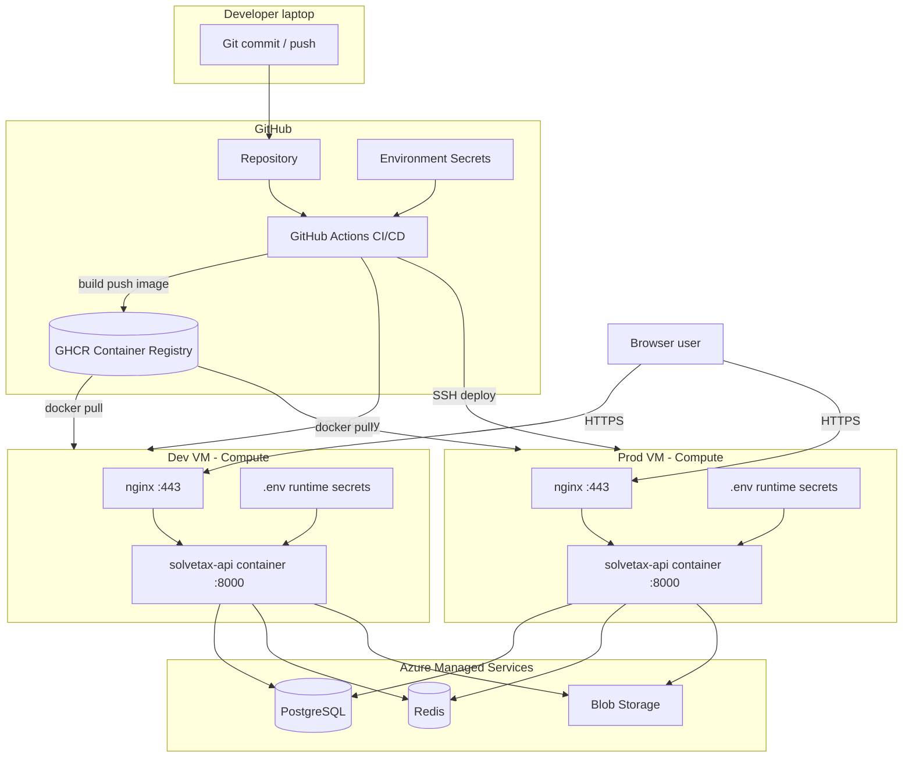

# Solvetax deployment — complete beginner guide (DevOps explained)

You do **not** need prior DevOps experience. This guide explains **what each piece is**, **why it exists**, and **exactly what to click or type**.

For a shorter checklist after you understand the concepts, see [DEPLOY.md](./DEPLOY.md).

---

## Table of contents

1. [What you are building](#1-what-you-are-building)
2. [DevOps glossary (read this first)](#2-devops-glossary-read-this-first)
3. [Architecture diagram](#3-architecture-diagram)
4. [Inventory — everything you need](#4-inventory--everything-you-need)
5. [Phase 1 — Source control (Git + GitHub)](#5-phase-1--source-control-git--github)
6. [Phase 2 — Compute (Azure VMs)](#6-phase-2--compute-azure-vms)
7. [Phase 3 — Networking & security](#7-phase-3--networking--security)
8. [Phase 4 — Managed data services (Azure)](#8-phase-4--managed-data-services-azure)
9. [Phase 5 — DNS & TLS (HTTPS)](#9-phase-5--dns--tls-https)
10. [Phase 6 — Containers on the VM (Docker)](#10-phase-6--containers-on-the-vm-docker)
11. [Phase 7 — CI/CD (GitHub Actions)](#11-phase-7-cicd-github-actions)
12. [Phase 8 — Secrets management](#12-phase-8--secrets-management)
13. [Phase 9 — First deploy (hands-on)](#13-phase-9--first-deploy-hands-on)
14. [Phase 10 — Daily workflow after setup](#14-phase-10--daily-workflow-after-setup)
15. [What people often forget](#15-what-people-often-forget)
16. [Troubleshooting by layer](#16-troubleshooting-by-layer)

---

## 1. What you are building

Solvetax is a **monorepo**:

| Part | Tech | Role |
|------|------|------|
| **Backend** | Python FastAPI | REST API, auth, business logic |
| **Frontend** | React + Vite | Browser UI (built to static files) |

In **production**, you ship **one Docker image** that contains:

- The Python API
- The compiled frontend (`frontend/dist`)

The API serves both API routes and the React app. You do **not** deploy frontend and backend as separate apps on separate servers (unless you change the design later).

**Environments:**

| Environment | Git branch | Server | Purpose |
|-------------|------------|--------|---------|
| **Development (dev)** | `dev` | Dev VM | Test changes safely |
| **Production (prod)** | `main` or `prod` | Prod VM | Real users |

---

## 2. DevOps glossary (read this first)

| Term | Plain English | In your project |
|------|---------------|-----------------|
| **CI** (Continuous Integration) | Automatically **build and test** code on every push/PR | Workflow `ci.yml` — npm build + Docker build |
| **CD** (Continuous Delivery/Deployment) | Automatically **ship** built artifacts to a server | Workflows `cd-dev.yml`, `cd-prod.yml` |
| **Pipeline** | The automated sequence: checkout → build → test → deploy | Your 3 GitHub Actions workflows |
| **Artifact** | Output of a build (here: a **Docker image**) | `ghcr.io/you/slovetax-1:dev` |
| **Container** | A running instance of an image (isolated process) | `solvetax-api` container on VM |
| **Docker image** | Frozen snapshot: OS + dependencies + your app | Built by `Dockerfile` |
| **Dockerfile** | Recipe to build the image | Root `Dockerfile` |
| **Docker Compose** | YAML file that starts multiple containers together | `docker-compose.prod.yml` |
| **Registry** | Storage for Docker images (like GitHub for images) | **GHCR** = GitHub Container Registry |
| **VM** (Virtual Machine) | A remote Linux server in the cloud | Azure Ubuntu VM |
| **Compute** | CPU/RAM you rent (the VM) | Azure B2s etc. |
| **IaaS** | Infrastructure as a Service — you manage OS + Docker; cloud gives VM + network | Azure VM model |
| **PaaS** | Platform manages more for you (e.g. Azure App Service) | You use VM + Docker instead |
| **Managed service** | Azure runs Postgres/Redis; you only configure | Azure Database for PostgreSQL, Azure Cache for Redis |
| **VNet** | Virtual network — private network inside Azure | VM lives in a VNet |
| **NSG** (Network Security Group) | **Firewall rules** for the VM (allow 80, 443, 22) | Azure portal → VM → Networking |
| **Public IP** | Internet address of your VM | e.g. `20.x.x.x` |
| **DNS** | Maps hostname → IP | `dev.solvetax.in` → dev VM IP |
| **A record** | DNS record type: name → IPv4 address | Required before HTTPS |
| **TLS / SSL** | Encryption for HTTPS | Let's Encrypt via **Certbot** |
| **Reverse proxy** | Front door that forwards traffic to your app | **nginx** (ports 80/443 → API :8000) |
| **SSH** | Secure remote shell into Linux VM | GitHub Actions uses SSH to deploy |
| **Environment** (GitHub) | Named target with its own secrets (`development`, `production`) | Dev vs prod deploy config |
| **Secret** | Encrypted config (passwords, SSH keys) | GitHub Secrets + VM `.env` |
| **Build-time env** | Baked into frontend at **image build** | `VITE_*` in GitHub Actions |
| **Runtime env** | Read when container **starts** | `DB_*`, `REDIS_*` in VM `.env` |
| **Health check** | URL that proves app is alive | `/health` |
| **Immutable deploy** | Deploy new image tag; don’t edit code on server | Pull `:dev` or `:prod` from GHCR |

---

## 3. Architecture diagram



**Traffic path (production request):**

```text
User browser
  → DNS resolves app.yourdomain.com to Prod VM public IP
  → TCP 443 to nginx container
  → nginx forwards to solvetax-api:8000 (Docker internal network)
  → FastAPI handles /api/* and serves React for /*
  → API talks to Azure Postgres, Redis, Blob (outbound from VM)
```

---

## 4. Inventory — everything you need

Before starting, gather or create:

| # | Item | Where | Notes |
|---|------|-------|-------|
| 1 | GitHub account + repo | github.com | Code + Actions |
| 2 | Domain name | Registrar (GoDaddy, Cloudflare, etc.) | e.g. `solvetax.in` |
| 3 | Dev VM | Azure | Ubuntu 22.04, public IP |
| 4 | Prod VM | Azure | Separate from dev |
| 5 | PostgreSQL | Azure | Connection string / host + password |
| 6 | Redis | Azure | Host + password |
| 7 | Blob Storage | Azure | Connection string for uploads |
| 8 | SMTP (email) | SendGrid / Azure / Gmail app password | For notifications |
| 9 | SSH key pair | Your PC | Public → VM, private → GitHub Secret |
| 10 | GitHub PAT | GitHub Settings → Developer settings | `read:packages` for VM pull |

**Cost mental model:** You pay for 2 VMs + Postgres + Redis + blob egress. Dev can use smaller SKUs.

---

## 5. Phase 1 — Source control (Git + GitHub)

### 5.1 Repository

1. Create GitHub repo (private recommended).
2. Push your code:

```bash
git remote add origin git@github.com:YOUR_ORG/slovetax-1.git
git push -u origin main
```

### 5.2 Branching strategy (GitFlow-lite)

| Branch | Meaning |
|--------|---------|
| `feature/*` | Your work |
| `dev` | Integrated staging → auto-deploys to **dev VM** |
| `main` (or `prod`) | Production-ready → auto-deploys to **prod VM** |

Create `dev`:

```bash
git checkout -b dev
git push -u origin dev
```

### 5.3 Enable GitHub Actions

**Repo → Settings → Actions → General**

- Actions permissions: **Allow all actions**
- Workflow permissions: **Read and write permissions** (needed to push to GHCR)

### 5.4 GitHub Environments (deployment targets)

**Repo → Settings → Environments**

Create:

1. **`development`** — maps to dev VM secrets  
2. **`production`** — maps to prod VM secrets  
   - Optional: **Required reviewers** = manual approval gate before prod deploy (recommended)

---

## 6. Phase 2 — Compute (Azure VMs)

A **VM** is your **application host**: Linux OS where Docker runs.

### 6.1 Create VM (Azure Portal)

For **each** environment (dev, then prod):

1. **Create a resource → Virtual machine**
2. **Image:** Ubuntu Server 22.04 LTS  
3. **Size:** Standard_B2s (2 vCPU, 4 GiB) minimum for dev  
4. **Authentication:** SSH public key (generate if needed):

```bash
# On Windows (PowerShell) or Mac/Linux
ssh-keygen -t ed25519 -C "solvetax-deploy" -f ~/.ssh/slovetax_deploy
```

- Public key (`slovetax_deploy.pub`) → paste in Azure VM creation  
- Private key (`slovetax_deploy`) → save for GitHub Secret `DEPLOY_SSH_KEY`

5. **Inbound ports:** Allow **22 (SSH), 80 (HTTP), 443 (HTTPS)**  
6. Note the **Public IP address** after creation.

### 6.2 First login (verify compute)

```bash
ssh -i ~/.ssh/slovetax_deploy azureuser@YOUR_VM_PUBLIC_IP
```

If this works, **compute + SSH + NSG port 22** are OK.

### 6.3 Install runtime on VM (bootstrap)

On the VM:

```bash
# Container runtime (Docker Engine)
curl -fsSL https://get.docker.com | sudo sh
sudo usermod -aG docker $USER
# Log out and SSH back in so docker group applies

sudo apt-get update
sudo apt-get install -y git gettext-base curl

# Application directory (convention: /opt/<app>)
sudo mkdir -p /opt/slovetax
sudo chown $USER:$USER /opt/slovetax
cd /opt/slovetax

# Deploy scripts + compose files (not the app image — that comes from GHCR)
git clone https://github.com/YOUR_ORG/slovetax-1.git .
```

Repeat on **both** dev and prod VMs.

---

## 7. Phase 3 — Networking & security

### 7.1 Layers of networking (outside → inside)

| Layer | What it controls | Your action |
|-------|------------------|-------------|
| **DNS** | Name → IP | A records for `dev.` and `app.` |
| **Azure NSG** | Which ports reach VM | Allow 22, 80, 443 inbound |
| **VM OS firewall** | Usually open if NSG allows | Ubuntu default OK |
| **Docker publish** | nginx maps 80:80, 443:443 | In `docker-compose.prod.yml` |
| **Docker bridge network** | API not exposed publicly; only nginx talks to it | `expose: 8000` not `ports: 8000` |

### 7.2 NSG rules (minimum)

| Priority | Port | Protocol | Source | Purpose |
|----------|------|----------|--------|---------|
| 100 | 22 | TCP | Your IP or VPN | SSH admin |
| 110 | 80 | TCP | Internet | HTTP + ACME challenge |
| 120 | 443 | TCP | Internet | HTTPS users |

**Security note:** Restrict SSH (22) to your office IP if possible, not `0.0.0.0/0`.

### 7.3 Outbound connectivity (often missed)

Your **API container** must reach:

- Azure PostgreSQL (usually port **5432**)
- Azure Redis (port **6380** with TLS, or 6379)
- Azure Blob (`*.blob.core.windows.net`)
- SMTP server

**Action:** On Azure Postgres and Redis, add **firewall rule: allow Dev VM public IP** and **Prod VM public IP** (different IPs = two rules each).

If the app crashes with `getaddrinfo failed` or connection timeout → **network/firewall/DNS**, not application bug.

---

## 8. Phase 4 — Managed data services (Azure)

These are **not** on your VM. The VM only runs **stateless** app containers.

### 8.1 PostgreSQL

- Create **Azure Database for PostgreSQL Flexible Server**
- Create database + user
- Copy: `DB_HOST`, `DB_USER`, `DB_PASSWORD`, `DB_NAME`, `DB_PORT`
- Run your SQL migrations on **dev DB** first, then **prod DB**

### 8.2 Redis

- Create **Azure Cache for Redis**
- Copy: `REDIS_HOST`, `REDIS_PASSWORD`, `REDIS_PORT`, `REDIS_SSL`

### 8.3 Blob Storage

- Storage account → Access keys → connection string  
- Used for file uploads in the app

### 8.4 Environment separation

| Resource | Dev | Prod |
|----------|-----|------|
| Postgres | Dev server or separate DB | Prod server |
| Redis | Dev cache | Prod cache |
| Blob | Dev container | Prod container |

**Never** point dev VM at production database.

---

## 9. Phase 5 — DNS & TLS (HTTPS)

### 9.1 DNS (Domain Name System)

At your domain registrar (or Cloudflare):

| Type | Host / Name | Value | TTL |
|------|-------------|-------|-----|
| A | `dev` | Dev VM public IP | 300 |
| A | `app` (or `@`) | Prod VM public IP | 300 |

Result: `dev.yourdomain.com` and `app.yourdomain.com`.

Verify:

```bash
nslookup dev.yourdomain.com
```

Must show your VM IP before SSL step.

### 9.2 TLS certificates (Let's Encrypt)

**TLS** encrypts traffic. **Certbot** obtains free certificates using HTTP-01 challenge on port 80.

On each VM, in `.env`:

```env
DOMAIN=dev.yourdomain.com
CERTBOT_EMAIL=admin@yourdomain.com
```

Then:

```bash
cd /opt/slovetax
bash deploy/azure-vm/setup-prod.sh          # HTTP first
bash deploy/azure-vm/init-letsencrypt.sh    # HTTPS
```

Set up **renewal** (cron):

```bash
crontab -e
# add:
0 3 * * * cd /opt/slovetax && bash deploy/azure-vm/ssl-renew.sh >> /var/log/solvetax-ssl-renew.log 2>&1
```

---

## 10. Phase 6 — Containers on the VM (Docker)

### 10.1 What runs in production

From `docker-compose.prod.yml`:

| Container | Role |
|-----------|------|
| **solvetax-api** | FastAPI + built React |
| **nginx** | Reverse proxy, TLS termination, static routing |
| **certbot** | One-off / renewal (profile `tools`) |

### 10.2 Runtime configuration on VM

```bash
cd /opt/slovetax
cp .env.example .env
nano .env
```

Critical variables (see `.env.example` for full list):

```env
# Image reference (CI sets tag at deploy time via API_IMAGE)
GHCR_IMAGE=ghcr.io/YOUR_GITHUB_USER/slovetax-1

# Data plane
DB_HOST=your-postgres.postgres.database.azure.com
DB_USER=...
DB_PASSWORD=...
DB_NAME=...
REDIS_HOST=...
REDIS_PASSWORD=...

# App secrets
JWT_SECRET=long-random-string

# Azure
AZURE_STORAGE_CONNECTION_STRING=...

# Edge
DOMAIN=dev.yourdomain.com
CERTBOT_EMAIL=...
```

**Never commit `.env` to Git.**

### 10.3 Manual first start (before CI exists)

```bash
export API_IMAGE=ghcr.io/YOUR_USER/slovetax-1:dev   # after first CI build
docker compose -f docker-compose.prod.yml up -d
curl -fsS http://127.0.0.1:8000/health    # if nginx not up yet
```

After CI/CD is wired, deploys use `remote-deploy.sh` instead.

---

## 11. Phase 7 — CI/CD (GitHub Actions)

### 11.1 The three workflows

| Workflow | Trigger | Jobs | Output |
|----------|---------|------|--------|
| **CI** | PR + push to dev/main | Build frontend, build Docker (no push) | Pass/fail check |
| **CD Dev** | Push to `dev` | Build → push `:dev` → SSH deploy | Dev site updated |
| **CD Prod** | Push to `main`/`prod` | Build → push `:prod`, `:latest` → SSH deploy | Prod site updated |

### 11.2 Pipeline stages (CD Dev example)

```text
1. Trigger: git push to branch dev
2. Runner: GitHub-hosted Ubuntu VM (ephemeral build agent)
3. Checkout source code
4. docker build (multi-stage: Node builds frontend, Python runtime)
5. docker push to GHCR with tag :dev
6. SSH to your Dev VM (using secrets)
7. docker login ghcr.io
8. remote-deploy.sh dev → pull image → compose up -d
9. Health check curl /health
```

### 11.3 GitHub Secrets (per Environment)

**Settings → Environments → development → Secrets**

| Secret | Description |
|--------|-------------|
| `DEPLOY_HOST` | VM public IP or hostname |
| `DEPLOY_USER` | SSH user (`azureuser`) |
| `DEPLOY_SSH_KEY` | **Entire** private key file contents |
| `DEPLOY_PATH` | `/opt/slovetax` |
| `DEPLOY_GHCR_TOKEN` | PAT with `read:packages` |
| `VITE_API_URL` | Usually empty string |
| `VITE_PUBLIC_API_KEY` | Public API key for marketing site |

Duplicate under **production** with prod VM values.

### 11.4 GHCR (Container Registry)

After first successful CD run:

**GitHub → Your repo → Packages** → `slovetax-1`

- **Private package:** VM needs `DEPLOY_GHCR_TOKEN` (workflow logs in over SSH)  
- **Public package:** `docker pull` works without login

### 11.5 Create GitHub PAT for `DEPLOY_GHCR_TOKEN`

1. GitHub → **Settings** (your profile) → **Developer settings** → **Personal access tokens**  
2. Fine-grained or classic with scope **`read:packages`**  
3. Paste into Environment secret `DEPLOY_GHCR_TOKEN`

---

## 12. Phase 8 — Secrets management

Two places — **do not mix them up**:

| Type | Examples | Stored where | Changes when |
|------|----------|--------------|--------------|
| **Build-time** | `VITE_API_URL`, `VITE_PUBLIC_API_KEY` | GitHub Environment secrets | Rebuild image (git push) |
| **Runtime** | `DB_PASSWORD`, `JWT_SECRET`, `REDIS_*` | VM file `/opt/slovetax/.env` | Edit `.env` + `docker compose up -d` |

**Rule:** Database passwords never go in GitHub Actions for build — only on the server.

---

## 13. Phase 9 — First deploy (hands-on)

Do these in order. Check off each step.

### Step 1 — GitHub

- [ ] Repo pushed, branches `dev` and `main` exist  
- [ ] Environments `development` + `production` created  
- [ ] All secrets added to **development** (use dev VM IP)  
- [ ] Actions read/write enabled  

### Step 2 — Dev VM

- [ ] VM created, ports 22/80/443 open  
- [ ] Docker installed  
- [ ] Repo cloned to `/opt/slovetax`  
- [ ] `.env` filled with **dev** Postgres/Redis/Blob  
- [ ] `DOMAIN` + `CERTBOT_EMAIL` set  
- [ ] DNS A record `dev.yourdomain.com` → dev VM IP  
- [ ] `bash deploy/azure-vm/setup-prod.sh`  
- [ ] `bash deploy/azure-vm/init-letsencrypt.sh`  

### Step 3 — Trigger CI/CD

```bash
git checkout dev
git commit --allow-empty -m "chore: trigger first dev deploy"
git push origin dev
```

### Step 4 — Verify pipeline

1. **GitHub → Actions → CD Dev** — all green  
2. On VM: `docker ps` — see `solvetax-api`, `solvetax-nginx`  
3. Browser: `https://dev.yourdomain.com/health` — should return OK  
4. Log in and click through one feature  

### Step 5 — Production (repeat with prod VM + production secrets)

- [ ] Prod VM + `.env` + DNS + SSL  
- [ ] Secrets in **production** environment  
- [ ] Merge `dev` → `main`, push  
- [ ] **CD Prod** green  
- [ ] `https://app.yourdomain.com/health` OK  

---

## 14. Phase 10 — Daily workflow after setup

```text
1. Create feature branch from dev
2. Code + test locally (python -m backend.main, npm run dev)
3. Open PR → dev (CI runs automatically)
4. Merge PR → CD Dev deploys → QA on dev URL
5. When ready: PR dev → main → merge → CD Prod deploys
6. Monitor Actions + /health + application logs
```

Useful commands **on the VM**:

```bash
cd /opt/slovetax

# Container status
docker compose -f docker-compose.prod.yml ps

# App logs
docker compose -f docker-compose.prod.yml logs -f solvetax-api

# Manual redeploy (same as CI)
bash deploy/azure-vm/deploy-from-ghcr.sh dev   # or prod
```

---

## 15. What people often forget

| Missed item | Symptom | Fix |
|-------------|---------|-----|
| Postgres firewall | App won't start, connection timeout | Allow VM public IP on Azure Postgres |
| Redis firewall / SSL | Redis errors in logs | Allow IP + set `REDIS_SSL=true` if required |
| Wrong `.env` on dev vs prod | Dev shows prod data | Separate DB + separate `.env` |
| DNS not propagated | SSL init fails | Wait / lower TTL / verify with `nslookup` |
| `DEPLOY_SSH_KEY` format | CD fails at SSH step | Include `-----BEGIN...` through `-----END...` |
| GHCR private, no PAT | `denied` on docker pull | Set `DEPLOY_GHCR_TOKEN` |
| Forgot `git clone` on VM | `remote-deploy.sh` not found | Clone repo to `DEPLOY_PATH` |
| Only opened port 443 | Let's Encrypt fails | Port **80** must be open |
| Changed `VITE_*` only in `.env` | Frontend unchanged | `VITE_*` must be in GitHub secrets + rebuild |
| No health check | Bad deploy looks successful | Always hit `/health` after deploy |
| DB migrations not run | 500 errors on API | Run SQL migrations per environment |
| Scheduler on multiple workers | Duplicate cron jobs | Keep `WORKERS=1` (already in Dockerfile) |

---

## 16. Troubleshooting by layer

Think **top to bottom**:

### Layer 1 — User / browser

- 502 / 504 → nginx up but API down → check API container logs  
- Certificate warning → SSL not initialized or expired → run `init-letsencrypt` / `ssl-renew`  

### Layer 2 — DNS

```bash
nslookup app.yourdomain.com
```
Wrong IP → fix registrar A record.

### Layer 3 — Network (NSG / Azure firewall)

- Can't SSH → port 22 / wrong key  
- Site unreachable → 80/443 NSG  
- App up but DB fails → Postgres/Redis firewall for VM IP  

### Layer 4 — Docker on VM

```bash
docker compose -f docker-compose.prod.yml ps
docker compose -f docker-compose.prod.yml logs solvetax-api --tail 100
```

- `Restarting` loop → usually bad `.env` or DB unreachable  

### Layer 5 — CI/CD (GitHub Actions)

- Red **CI** → fix build locally first  
- Red **deploy** → SSH secrets or script path  
- Green deploy but old version → check `docker images` for correct `:dev`/`:prod` tag  

### Layer 6 — Application / data

- Migrations, wrong credentials, missing blob container  

---

## Quick reference — who owns what

| Concern | Owner / tool |
|---------|----------------|
| Code | GitHub repo |
| Build & deploy automation | GitHub Actions |
| Image storage | GHCR |
| App runtime | Docker on Azure VM |
| HTTPS edge | nginx + Let's Encrypt |
| Database | Azure PostgreSQL |
| Cache | Azure Redis |
| Files | Azure Blob |
| Domain | Your registrar |
| Runtime secrets | VM `.env` |
| Build-time frontend config | GitHub Environment secrets |

---

## Next steps

1. Work through [Phase 9](#13-phase-9--first-deploy-hands-on) on **dev only** first.  
2. When dev is stable, repeat for **prod**.  
3. Keep [DEPLOY.md](./DEPLOY.md) as your operational checklist.

If you get stuck, note **which layer** (DNS, SSH, Actions, Docker, DB) and the **exact error message** — that maps directly to the fix.
