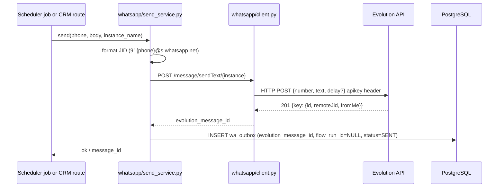

# Integration Architecture for SolvetaxAdmin — Evolution API

> **Status:** Planning / pre-build. No code changes described here. All module names and paths reference the current codebase.

---

## 1. Use-Case Map

The table below maps each SolveTax client-communication need to the specific Evolution API capability and the backend module that owns the trigger or data.

| SolveTax Need | Evolution API Feature | Endpoint / Event | Backend Module |
|---|---|---|---|
| GST filing deadline reminders | Scheduled outbound text | `POST /message/sendText/{instance}` | `schedular/schedular.py` (new job slot), `gst_registration_filing/status_constants.py` for due-date data |
| Document collection requests | Outbound text with instructions | `POST /message/sendText/{instance}` | `gst_registration/gst_documents.py`, triggered from `gst_registration_filing/gst_registration_filing.py` on stage change |
| Receiving client documents as media | Inbound `imageMessage` / `documentMessage` | `MESSAGES_UPSERT` webhook event | `gst_registration/gst_blob.py` (download + re-upload to Azure Blob), `gst_registration/gst_documents.py` (metadata row) |
| Payment reminders with amount | Outbound text showing balance due | `POST /message/sendText/{instance}` | `payments/payments_config.py` (`resolve_entity_remaining_amount`), `follow_ups/payments_followup.py` |
| Campaign broadcasts to lead segments | Batch outbound to filtered CRM leads | `POST /message/sendText/{instance}` (looped with `delay` field) | `crm/crm_leads_common.py` (filter/list APIs supply recipient set) |
| Two-way client chat inside CRM | Full conversation: send + receive + history display | Outbound: `sendText`; Inbound: `MESSAGES_UPSERT` | `crm/crm_leads_gst.py`, `crm/crm_leads_itr.py`, new `whatsapp/conversation_service.py` |
| Follow-up automation | Auto-send message when `followup_at` is due | `POST /message/sendText/{instance}` | `schedular/schedular.py` (new job slot reads `follow_up_status=PENDING` + `followup_at <= now`) |
| Client onboarding messages | Welcome text on new registration | `POST /message/sendText/{instance}` | `customer_registration/customer.py` (post-create hook), `gst_registration/gst_registration.py` (post-create hook) |
| Voice note handling | Inbound `audioMessage` receipt; optional Whisper transcription | `MESSAGES_UPSERT` (`messageType: audioMessage`); Evolution's built-in OpenAI integration (Whisper-1) | `whatsapp/conversation_service.py`; staff views transcript inline in CRM chat panel |

**Notes on the "campaign" module:** `backend/campaign/campaign.py` is a UTM/device-analytics ingest pipeline — it is not a messaging module and must not be modified for WhatsApp sends. Any broadcast feature sits in a new section of the CRM, using `crm/crm_leads_common.py` filter APIs to build the recipient list.

**Note on `sendButtons` / `sendList`:** Both are documented for Baileys but are broken in v2.3.7 (returns 201, never delivers; closed as "not planned"). Interactive message types are not available on Baileys in the current stable release. Payment links and document type selection must be delivered as plain text. Verify against release notes before building if interactive messages are required.

---

## 2. Proposed Backend Design

### 2.1 Module Layout

A new `backend/whatsapp/` package follows the same conventions as existing modules:

```
backend/whatsapp/
    __init__.py
    router.py          # FastAPI APIRouter; webhook receiver + management endpoints
    client.py          # httpx wrapper for outbound Evolution API calls
    send_service.py    # message-send business logic; called by scheduler and other modules
    conversation_service.py  # inbound message handling; conversation + message persistence
    schemas.py         # Pydantic models for webhook payloads and API request/response
    instance_service.py      # instance lifecycle: create, QR state, reconnect
```

`router.py` is imported and registered in `backend/main.py` using the existing pattern:

```python
# in main.py — same pattern as all 30+ existing routers
from backend.whatsapp.router import router as whatsapp_router
if whatsapp_router:
    app.include_router(whatsapp_router)
```

The router declares its own prefix (e.g. `/api/v1/whatsapp`).

### 2.2 Component Responsibilities

> **SDK evaluation note:** An official Python client SDK (`evolutionapi` on PyPI, `github.com/EvolutionAPI/evolution-client-python`) is referenced in `03-api-reference.md` but not evaluated in this document. Before implementing `client.py`, assess whether the SDK covers the v2.3.7 endpoints SolveTax needs. A custom `httpx` wrapper is specified here for the following reasons: the SDK may lag behind v2.3.7 endpoint changes, the wrapper is limited to the exact subset of endpoints SolveTax requires (reducing surface area), and it avoids an additional transitive dependency. If the SDK was not formally evaluated, do so before building `client.py` — if it covers the required endpoints and is actively maintained against v2.3.7, it may eliminate the need for `client.py` entirely.

**`client.py` — Evolution API HTTP client**

- Wraps `httpx.AsyncClient`. Add `httpx` explicitly to `requirements.txt` (or `pyproject.toml`) — it is not guaranteed to be installed in the production environment (FastAPI depends on Starlette; Starlette lists `httpx` as a test-only optional extra, not a production dependency). Pin a specific minor version (e.g. `httpx>=0.27,<0.28`). Alternatively, use `aiohttp` which is already well-established for async HTTP clients in Python; choose whichever the team prefers, but make it an explicit dependency.
- Reads `EVOLUTION_API_URL` and `EVOLUTION_API_KEY` from env via `os.getenv`.
- Adds `apikey: <EVOLUTION_API_KEY>` header on every request (Evolution v2 auth model).
- Returns parsed JSON; raises typed exceptions on non-2xx.
- Fail-open policy: errors are logged via the project `logger` and surfaced as a service error, not a hard 500 to the caller, so a disconnected Evolution API instance does not break unrelated CRM routes.

**`send_service.py` — outbound message sends**

- Called by: `schedular/schedular.py` (reminder jobs and workflow engine dispatch step 14c), `crm/` routes (staff-initiated send), `customer_registration/customer.py` (onboarding), `gst_registration/gst_registration.py` (onboarding). The workflow engine (`flow_engine.py`, doc 09 §3.5) also routes all flow-driven sends through this service via `wa_outbox` — no flow definition can bypass the consent, quiet-hours, or rate-limit guardrails enforced here.
- Accepts `phone: str` (10-digit, no prefix), `body: str`, `instance_name: str`, `category: str`. Message templates are Python constants in Phase 1–2 — a module-level dict keyed by category enum (e.g. `TEMPLATES: dict[str, str] = {MessageCategory.DEADLINE_REMINDER: "...", ...}`). No `wa_template_registry` table is built in Phase 1–2: hardcoded constants are sufficient for 20–50 clients and 4 message types, avoiding a new migration, new CRUD endpoints, and runtime schema coupling. If admins need runtime template editing without a redeploy, add `wa_template_registry` at that point as a new migration. Do not build it speculatively.
- Prefixes phone to E.164 format (`91{phone}@s.whatsapp.net`) internally before passing to `client.py`.
- Persists a `wa_outbox` row (with `flow_run_id=NULL` for direct/Phase-1 sends) after the Evolution API round-trip, using the returned `key.id`. All outbound sends — Phase 1 hardcoded scheduler, staff-initiated, onboarding, and flow-engine — write to `wa_outbox`; this is the single table the doc 09 §3.9 activity log queries. Direct sends use `flow_run_id=NULL` to distinguish them from flow-driven sends; direct sends supply an explicit `idempotency_key` (`'{category}:{entity_id}:{IST-date}'`) via the shared key helper (doc 09 §3.5).
- Does not block callers on Evolution API latency (callers are async; `await send_service.send(...)` returns after the Evolution API round-trip).

**`conversation_service.py` — inbound message handling**

- Called exclusively from `router.py`'s webhook receiver.
- Looks up or creates a `wa_conversations` row keyed by `remoteJid`.
- Deduplication uses two layers: (1) Redis SET NX `key=wa:msg:{data.key.id}` EX 300 as a fast-reject before touching the DB — skipped if Redis is unavailable (fail-open, matching the codebase's existing Redis fail-open policy in `redis_cache.py`). (2) `INSERT wa_messages ON CONFLICT (evolution_message_id) DO NOTHING` as the authoritative deduplication guard. Both layers are needed because Redis is configured fail-open in this codebase; relying only on Redis NX means duplicates reach the DB under a Redis outage. The DB unique constraint is the reliable guard; the Redis NX check is a fast-path optimization only.
- Attempts to resolve `remoteJid` phone number to a `customers.customer_id` by stripping the `@s.whatsapp.net` suffix and the `91` country prefix, then matching against `customers.mobile` (10-digit TEXT).
- If the message carries an `imageMessage` or `documentMessage` and the conversation is linked to a customer with an active GST registration, creates a pending staff action; does not auto-attach without staff confirmation.
- Updates `crm_leads.follow_up_status` to `COMPLETED` if an inbound message matches a lead's `mobile` and the lead has `follow_up_status=PENDING`.

**`router.py` — endpoints**

| Method | Path | Auth | Purpose |
|---|---|---|---|
| `POST` | `/api/v1/whatsapp/webhook` | `X-Webhook-Secret` header check | Receive Evolution API events |
| `POST` | `/api/v1/whatsapp/send` | JWT (`require_permission`) | Staff-initiated message send |
| `GET` | `/api/v1/whatsapp/conversations/{phone}` | JWT | Fetch conversation thread for CRM chat panel |
| `GET` | `/api/v1/whatsapp/instances` | JWT + `require_admin()` | List registered instances and connection state |
| `POST` | `/api/v1/whatsapp/instances/{name}/connect` | JWT + `require_admin()` | Trigger QR generation; polls `GET /instance/connect/{name}` on Evolution API |
| `GET` | `/api/v1/whatsapp/instances/{name}/qr` | JWT + `require_admin()` | Return current QR base64 from Redis cache (set by webhook handler on `QRCODE_UPDATED`) |

**Webhook authentication:** Evolution API sends a configurable `headers` object in its webhook configuration (set via `POST /webhook/set/{instance}`). The team sets a shared secret there, e.g. `Authorization: Bearer <EVOLUTION_WEBHOOK_SECRET>` or a custom `X-Webhook-Secret` header. The receiver in `router.py` verifies this header using a constant-time compare against `EVOLUTION_WEBHOOK_SECRET` env var, matching the pattern used by `enforce_public_security()` in `security/public_security.py`. The `/webhook` path is exempted from `TokenValidatorMiddleware` (add it to `PUBLIC_EXACT_ENDPOINTS` in `token_validator.py`).

The receiver must return HTTP 200 immediately and dispatch processing to an async coroutine. Evolution API's retry policy (exponential backoff, up to 10 attempts) treats anything other than a 2xx as a delivery failure and retries.

The webhook receiver is also consumed by the workflow engine (doc 09 §3.5): inbound `MESSAGES_UPSERT` events resume `Wait (reply)` runs and enroll new `InboundKeyword` flows in `wa_flow_runs`. This logic runs inside the same `POST /api/v1/whatsapp/webhook` handler, after the conversation-service path. Flow logic runs only for direct-chat, not-fromMe events — fromMe echoes and group JIDs are discarded before any flow processing (doc 09 §3.5).

### 2.3 Sequence Diagrams

#### Outbound Message Send (staff-initiated or scheduler-triggered)



#### Inbound Message Received (client replies on WhatsApp)

```mermaid
sequenceDiagram
    participant EvoAPI as Evolution API
    participant Webhook as POST /api/v1/whatsapp/webhook
    participant ConvSvc as whatsapp/conversation_service.py
    participant DB as PostgreSQL
    participant Cache as Redis

    EvoAPI->>Webhook: POST {event: messages.upsert, data: {key, message, messageType...}}
    Webhook->>Webhook: verify X-Webhook-Secret header
    Webhook-->>EvoAPI: 200 OK  (immediate; processing continues async)
    Webhook->>ConvSvc: handle_inbound(payload)
    ConvSvc->>DB: UPSERT wa_conversations (by remoteJid)
    ConvSvc->>DB: INSERT wa_messages ON CONFLICT (evolution_message_id) DO NOTHING
    ConvSvc->>DB: lookup customers.mobile → customer_id
    ConvSvc->>DB: update crm_leads follow_up_status if applicable
    ConvSvc->>Cache: invalidate crm lead cache tag (crm:leads:filter:index)
```

---

## 3. Data Model Additions

Described as logical entities; SQL DDL to follow the project's migration pattern (`db/migrations/` + new versioned scripts, e.g. `V003__whatsapp_slice0.sql`).

### `wa_instance_registry`

Tracks registered Evolution API instances. One row per WhatsApp phone number connected to this SolvetaxAdmin deployment.

Fields: `instance_name` (primary key, matches Evolution API instance name), `phone_e164` (E.164 format, e.g. `919876543210`), `department_label` (display name for admin UI), `connection_state` (enum: `DISCONNECTED` / `CONNECTING` / `CONNECTED`), `last_connected_at`, `created_at`, `created_by` (employee FK).

### `wa_conversations`

One row per unique WhatsApp thread (one thread = one `remoteJid`). Threads can be 1:1 with a customer or unresolved (no `customer_id` match yet).

Fields: `conversation_id` (PK), `instance_name` (FK → `wa_instance_registry`), `remote_jid` (WhatsApp JID, unique per instance), `customer_id` (nullable FK → `customers.customer_id`; populated on phone match), `last_message_at`, `created_at`.

Index candidate: `(instance_name, remote_jid)` unique; `(customer_id)` for CRM panel lookups.

### `wa_messages`

One row per message in either direction. The `evolution_message_id` unique constraint is the primary deduplication guard against Evolution API's at-least-once webhook delivery.

Fields: `message_id` (PK), `conversation_id` (FK), `evolution_message_id` (UNIQUE — `data.key.id` from payload), `direction` (enum: `INBOUND` / `OUTBOUND`), `message_type` (text/image/audio/document/reaction — `data.messageType` from payload), `body_text` (nullable), `media_url` (nullable — Azure Blob URL after re-upload, or Evolution presigned URL if S3/MinIO is configured), `status` (enum: `SENT` / `DELIVERED` / `READ` / `PLAYED`), `sent_by_emp_id` (nullable FK — set for OUTBOUND staff messages), `message_timestamp` (Unix seconds from `data.messageTimestamp`), `created_at`.

Status updates arrive via `MESSAGES_UPDATE` webhook events and patch existing rows by `evolution_message_id`.

### `wa_consent`

Opt-in / consent records for client WhatsApp communications. India's DPDP Act (Rules notified November 2025, enforcement deadline May 2027) requires explicit, purpose-specific consent before storing or processing WhatsApp data.

Fields: `consent_id` (PK), `customer_id` (FK → `customers.customer_id`), `phone` (10-digit, matches `customers.mobile` format), `consented_at`, `consent_source` (enum: `PUBLIC_FORM` / `STAFF_RECORDED` / `IMPORT`), `revoked_at` (nullable — right-to-erasure trigger), `purpose` (enum: `SERVICE_UPDATES` / `MARKETING`), `recorded_by_emp_id` (nullable FK).

Existing `customers` table has no consent fields — add a `wa_consent_status` computed or join check in the send path: refuse to send if no active consent row exists for the phone/purpose combination. The `customers.mobile` field is already stored as a 10-digit TEXT string without country prefix; consent rows use the same format for direct join.

### Workflow Engine Tables (forward reference)

The node-based workflow builder (doc 09) adds four tables in a single migration (`VXXX__whatsapp_flow_engine.sql`): `wa_instance_config` (runtime guardrail config per instance), `wa_flows` (flow definitions with `draft_data` / `live_data` JSONB), `wa_flow_runs` (per-customer execution state), and `wa_outbox` (idempotent send queue with 30-day data-minimisation purge). Full DDL and schema rationale are in `09-node-workflow-builder.md §3.5`.

---

## 4. Existing Channel Coexistence and Migration

### Current Channel State

The codebase currently has **no Twilio integration**. The only outbound communications channel is SMTP email in `backend/utils.py:send_email_otp()`, used exclusively for **employee** OTP flows (email verification on signup via `sign_up/email_verification.py`; password reset via `sign_up/forgot.py`). There are no client-facing outbound notifications of any kind.

### Coexistence Plan

| Channel | Used For | Module | Change |
|---|---|---|---|
| SMTP email (`smtplib`) | Employee OTP (email verification, password reset) | `backend/utils.py` | None — do not touch |
| WhatsApp via Evolution API | All client-facing messaging | New `backend/whatsapp/` | Add |

The two channels serve entirely different audiences (employees vs clients) with entirely different payload types (OTP codes vs WhatsApp messages). No routing layer is needed to choose between them.

### Abstraction Seam Recommendation

Do not create a generic `NotificationService` or `MessageChannel` interface upfront. With two channels having different callers, different payload shapes, and different failure modes, a shared abstraction buys nothing and adds indirection without simplifying any real call site (YAGNI).

The correct seam is at the **call site** level: code that triggers a client WhatsApp message calls `whatsapp.send_service.send()`; code that triggers an employee OTP calls `utils.send_email_otp()`. If a third channel (SMS OTP for clients) is added later and routing logic becomes conditional, revisit then with a thin protocol/interface over exactly the two cases being dispatched.

If Twilio is later introduced for SMS (e.g. client OTP backup), add it as a third separate utility function (`utils.send_sms_otp()`) before abstracting. Do not abstract until there are at least three call sites sharing the same routing logic.

---

## 5. Frontend Touchpoints

The frontend has two protected route SPAs: `/dashboard` (tab-based) and `/crm-dashboard` (separate CRM). WhatsApp surfaces in both.

### CRM Dashboard (`/crm-dashboard`)

| Screen / Component | Change | What It Does |
|---|---|---|
| `CrmLeadRowActions.jsx` | Add WhatsApp icon button alongside existing View / call_status / History buttons | Opens WhatsApp drawer for the lead's `mobile` field; one `onWhatsApp` prop wired from `Leads.jsx` |
| `CrmLeadViewDrawer.jsx` | Add `whatsapp` section to existing `VIEW_SECTIONS` | Shows last N messages inline; text-input + send button; richest UX without a new drawer |
| New `CrmLeadWhatsAppDrawer.jsx` | New slide-in component (same pattern as `CrmLeadCallActionDrawer.jsx`) | Full scrollable conversation thread + message composer; `createPortal` to `document.body` |
| `crm_dashboard.jsx` sidebar | New `conversations` tab entry | Inbox view of all WhatsApp threads across all leads (similar to how SmartBoard shows all leads in kanban) |
| New `frontend/src/utils/crmWhatsAppApi.js` | New API utility file | Calls `GET /api/v1/whatsapp/conversations/{phone}`, `POST /api/v1/whatsapp/send`, `GET /api/v1/whatsapp/instances` |

**Implementation priority order:** Row action button → WhatsApp section inside `CrmLeadViewDrawer` (reuses existing drawer UX) → dedicated drawer → Conversations inbox tab.

### Main Dashboard (`/dashboard`)

| Tab / Component | Change | What It Does |
|---|---|---|
| `Payments` component (`tab=payments`) | "Send WhatsApp reminder" action on PENDING payment rows | Calls `POST /api/v1/whatsapp/send` with payment amount from `payments_config` public endpoint |
| `GSTRegistration` component (`tab=gst`, `sub=registrations`) | "Request documents via WhatsApp" button on registration rows | Sends pre-defined `DOCUMENT_REQUEST` template; links document checklist |
| `SettingsTab` component (`tab=settings`) | New "WhatsApp Instances" section | Shows instance registry list, QR connection flow, connection state badges |

### QR Connection Flow (Settings UI)

1. Admin clicks "Connect Instance" in Settings → WhatsApp Instances.
2. Frontend calls `POST /api/v1/whatsapp/instances/{name}/connect`.
3. Frontend begins polling `GET /api/v1/whatsapp/instances/{name}/qr` every 3 seconds.
4. Backend webhook handler receives `QRCODE_UPDATED` event, stores `data.qrcode.base64` in Redis with ~40-second TTL (QR codes expire approximately every 45 seconds).
5. QR endpoint reads from Redis and returns the base64 string; frontend renders it as ``.
6. On `CONNECTION_UPDATE` event with `state: "open"`, backend updates `wa_instance_registry.connection_state = CONNECTED`; frontend polling detects state change and shows "Connected" badge.
7. On failure (`statusReason: 403` = banned), frontend shows red alert with ban detail.

The toast bus (`window.dispatchEvent(new CustomEvent('st_show_toast', ...))`) already used by Dashboard can carry connection-state notifications without new infrastructure.

---

## 6. Instance Strategy

### How Many Numbers

**Start with one.** A single WhatsApp Business number serving all SolveTax client communications is the minimum viable setup. It avoids:
- Multi-instance routing complexity in `send_service.py`
- Staff confusion about which number to check
- Multiple QR scan/reconnect events to manage

Revisit when one of these conditions is true: daily message volume approaches WhatsApp's per-number limits (verify against current BSP documentation), or departments explicitly need separate sender identities (e.g. "SolveTax GST Team" vs "SolveTax ITR Team"). At that point, add instance-name routing logic in `send_service.py` and an instance picker in the CRM send form.

### Connection Channel: Baileys vs Meta Business API

Evolution API supports two connection backends. **This is the most important decision before any build work** (see also section 7).

| Factor | Baileys (unofficial) | Meta WhatsApp Business API (official) |
|---|---|---|
| Cost | Free | Per-message charges (verify current India rates with a BSP) |
| ToS compliance | Violates WhatsApp ToS | Compliant |
| Ban risk | 68% of Indian businesses report at least one ban within 12 months (per research) | No ban risk if used within policy |
| Template requirement | Free-form messages allowed | Marketing/utility messages require pre-approved templates |
| `sendTemplate` | Not available on Baileys | Cloud API only |
| Setup time | Scan QR, immediate | Meta Business Manager verification (days to weeks) |

For a regulated-adjacent business (tax services with client financial data under DPDP Act scrutiny), Meta Business API is the defensible choice.

### QR Onboarding Flow in Admin UI

Covered in section 5. Key operational notes:
- `QRCODE_LIMIT` in Evolution API config (default 30 regeneration attempts per session); configure to a lower value (e.g. 10) to avoid indefinite re-scan loops.
- `DEL_INSTANCE` env var defaults to `false` (disconnected instances are not auto-deleted); leave at default so reconnect does not lose the instance record.
- `CONFIG_SESSION_PHONE_VERSION` is sensitive in some Evolution versions; verify against release notes for v2.3.7 before deployment (known issue: wrong value breaks QR pairing).

### Reconnect Handling

`CONNECTION_UPDATE` webhook events with `state: "close"` require action:

| `statusReason` | Meaning | Action |
|---|---|---|
| 401 | Unauthorized / session expired | Staff must re-scan QR (`PUT /instance/restart/{name}` → new QR) |
| 403 | Banned by WhatsApp | Do not attempt reconnect; alert admin; number may be permanently banned |
| 408 | Timeout | Auto-restart via `PUT /instance/restart/{name}` after 60-second backoff |
| 428 | Conflict (logged in elsewhere) | Force logout other session; restart |
| 440 | Replaced | New session on another device; restart |
| 515 | Stream error | Auto-restart with backoff |

The scheduler (`schedular/schedular.py`) can add a periodic connection-state health check job calling `GET /instance/connectionState/{name}` on Evolution API; on `state != "open"`, write to `wa_instance_registry.connection_state` and enqueue an in-app notification to admins via the existing `st_notifications` localStorage/event-bus mechanism.

---

## 7. Open Decisions

The following must be resolved by the team before implementation begins. No code should be written until decisions 1, 2, and 3 are made. Decision 4 is resolved — see below.

1. **Baileys vs Meta Business API (critical).**  
   Using Baileys violates WhatsApp ToS. For a tax-services company whose reputation depends on client trust, a number ban — even temporary — is a serious operational risk. The team must decide whether to use the official Meta WhatsApp Business API (requires BSP enrollment and per-message cost) or accept Baileys risk. The architecture described here works with both; the `client.py` calls remain the same.

2. **DPDP Act compliance posture.**  
   India's Digital Personal Data Protection Act (Rules notified November 2025, enforcement deadline May 2027) requires explicit, purpose-specific opt-in consent before storing or processing client WhatsApp messages. The `wa_consent` table is proposed, but the consent-capture UX (where and when staff or clients record consent) and data retention / erasure policy must be defined by the team and reviewed by their legal contact before build.

3. **Evolution API version.**  
   v2.3.7 is the current stable release (December 2024). v2.4.0-rc2 (May 2026) introduces mandatory license activation against Evolution Foundation's licensing server before the API serves any traffic — a breaking change that adds an external dependency for self-hosted deployments. Team must decide which version to deploy and whether the license activation step is acceptable.

4. **Azure deployment target for Evolution API** — *resolved: B1 is the starting point.*  
   Start with option (a): second Azure Web App on the `solvetax-dev-plan` B1 SKU. Phase 0 exit criteria include a 24-hour memory check — if the Evolution API container peak exceeds 1.2 GB, move Evolution API to Azure Container Instance (ACI) before Phase 1. If Phase 0 memory check fails, move Evolution API to ACI before Phase 1.

5. **Postgres database for Evolution API.**  
   Evolution API needs its own Postgres database (Prisma runs migrations at startup). Options: separate database in the existing Azure Database for PostgreSQL flexible server, or a separate schema. Evolution's Prisma schema is complex; a dedicated database is cleaner. Env var: `EVOLUTION_DB_*`.

6. **Redis sharing.**  
   Can reuse the existing Redis Cache instance with a different key namespace (prefix `evo:`) or deploy a separate Redis. Existing Redis is already used for the scheduler leader lock, rate limiting, and query caching — confirm capacity before sharing.

7. **`WORKERS` must stay at 1.**  
   The project README and deployment map note `WORKERS` must remain 1 due to the in-process asyncio scheduler. A high-volume webhook receiver on the same single-process uvicorn is viable at low message rates but could introduce latency under load. If message volume grows significantly, consider extracting the scheduler to a separate container (a larger change) rather than increasing workers.

8. **Media document handling scope.**  
   When a client sends a photo/document via WhatsApp, should it: (a) auto-attach to their open GST registration document list in `gst_documents`, (b) appear in the conversation thread for staff to manually attach, or (c) both? Option (b) is safer and requires less automation logic. Define the staff workflow before building `conversation_service.py` media handling.

9. **Consent capture UX.**  
   When does a customer give WhatsApp consent? Candidates: on the public form submit (`POST /api/v1/customers`), on first outbound message (implied consent — legally weak under DPDP), or a separate opt-in link. Must be resolved before the `wa_consent` table structure is finalized.

10. **Template inventory.**  
    Which messages should be pre-defined templates vs free-form staff messages? At minimum: GST deadline reminder, document collection request, payment reminder with amount, welcome/onboarding. Templates must be drafted, reviewed for accuracy (GST due dates, correct amounts), and, if using Meta Business API, pre-approved through Meta before go-live.

11. **Voice note transcription dependency.**  
    Evolution API's built-in OpenAI Whisper integration transcribes inbound `audioMessage` events. This adds `OPENAI_API_KEY` as a new secret. The team already has `AZURE_OPENAI_*` credentials for the business-description AI feature; verify whether Azure OpenAI Whisper is compatible with Evolution's OpenAI integration, or whether a separate OpenAI API key is needed. Alternatively, skip voice transcription in v1 and display a "Voice note received — open WhatsApp to listen" placeholder.

12. **Webhook duplicate-delivery handling.**  
    Evolution API has known duplicate-delivery bugs (webhook issues #1325, #2110 in the repository). The `evolution_message_id` unique constraint on `wa_messages` (using `data.key.id`) is the deduplication guard. Confirm the insert uses `ON CONFLICT (evolution_message_id) DO NOTHING` to ensure idempotency under duplicate delivery.

---

## Sources

- Evolution API canonical repository: https://github.com/evolution-foundation/evolution-api
- Evolution API official documentation: https://docs.evolutionfoundation.com.br (redirected from doc.evolution-api.com)
- Evolution API Postman workspace (collections up to v2.2.2): referenced in research summaries
- Evolution API v2.3.7 release notes (December 5, 2024): https://github.com/evolution-foundation/evolution-api/releases/tag/2.3.7
- Evolution API v2.4.0-rc2 pre-release (May 17, 2026): https://github.com/evolution-foundation/evolution-api/releases/tag/2.4.0-rc2
- Evolution API Docker image: https://hub.docker.com/r/evoapicloud/evolution-api
- WhatsApp Business API (Meta Cloud API): https://developers.facebook.com/docs/whatsapp/cloud-api
- India DPDP Act (Digital Personal Data Protection Act 2023, Rules 2025): https://www.meity.gov.in/content/digital-personal-data-protection-act-2023
- Evolution API webhook delivery research: issues #1325, #2110 on https://github.com/evolution-foundation/evolution-api/issues
- Evolution API `sendButtons`/`sendList` Baileys regression: https://github.com/evolution-foundation/evolution-api/issues (closed as "not planned" in v2.3.7)
- CONFIG_SESSION_PHONE_VERSION known issue: https://github.com/atendai/evolution-api/issues/1474
- SolvetaxAdmin backend architecture map: internal codebase analysis (this session)
- SolvetaxAdmin frontend and deployment map: internal codebase analysis (this session)
