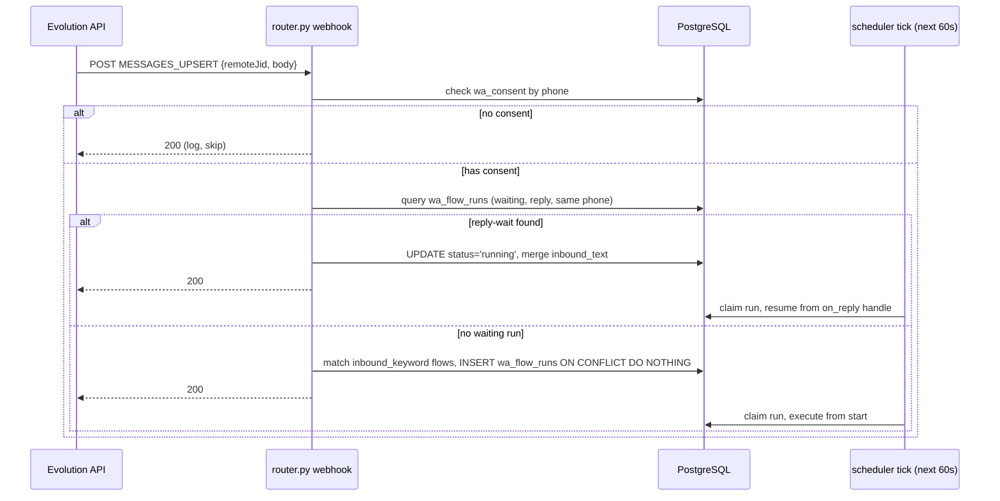

# 09 — Node-Based WhatsApp Workflow Builder

> **Status:** Planning / pre-build. No code changes are described here. All module paths reference the current codebase. Prerequisite reading: `06-solvetax-integration-architecture.md`, `07-risks-compliance.md`, `08-rollout-plan.md`.

---

## 1. Requirement and Use Cases

The founder wants staff to visually compose WhatsApp automation flows inside SolvetaxAdmin. Two distinct flow shapes are required and behave differently at runtime:

**Inbound bots** — an unsolicited client WhatsApp message triggers a flow. The bot guides the conversation: menu triage (GST status, payment balance, document upload, human handoff), document collection dialogs, FAQ replies, and escalation to an RM. The flow waits for client replies and branches on their content.

**Outbound journeys** — a CRM event or a deadline date triggers a sequence without client initiation. Examples: GST filing due in 7 days → send reminder → wait 2 days → if still unfiled, send follow-up → wait 2 more days → if still unfiled, create RM task. Payment installment due → remind. Onboarding welcome on customer creation. Document chase until documents received. The flow sleeps on time delays; it does not wait for replies in most steps.

Both shapes must respect `wa_consent`, IST quiet hours (09:00–21:00), and the Baileys warm-up send-rate caps from `07-risks-compliance.md §5`. Guardrails live in `send_service.py`, not inside individual flow definitions. No flow definition can bypass them regardless of how it is authored.

### 1.1 Trigger Catalog

| Trigger | Source Table / Field | Code Path Today | Needs New Hook? |
|---|---|---|---|
| Inbound WhatsApp message | Evolution API `MESSAGES_UPSERT` event | Not built — `POST /api/v1/whatsapp/webhook` planned in doc 06, not yet implemented | Yes — webhook receiver in `backend/whatsapp/router.py` |
| GST deadline approaching | `gst_filing_return_details` (`gstr3b_due_date`, `gstr1_due_date`, `gstr9_due_date`, etc.) | No scheduler job reads these for WA sends | Yes — new scheduler step in `schedular/schedular.py` |
| GST return status → MISSED | `gst_filing_return_details` step 7 | `_mark_overdue_gst_return_statuses` runs every 60s | Yes — post-mark call to enroll flow run |
| Payment installment due | `payments.followup_at` WHERE `payment_status='PENDING'` AND `remaining_amount > 0` | Steps 2b/2c mark MISSED; no WA hook | Yes — new scheduler step |
| CRM follow-up → MISSED | `crm_leads.followup_at` step 3 | Step 3 marks MISSED; no WA hook | Yes — post-mark call to enroll flow run |
| CRM stage → GST_REGISTRATION_DONE | `gst_registration/gst_registration.py` `_sync_crm_leads_on_gst_approval` | Fires inside registration APPROVED edit — exists | Yes — post-commit call to `_maybe_start_flow()` |
| CRM stage → SUBSCRIBED (GST payment PAID) | `payments/registration_payments.py` `create_registration_payment` | Fires inside payment insert — exists | Yes — post-commit call to `_maybe_start_flow()` |
| CRM stage → ITR_DONE (`filed_status` → FILED) | `Income_tax/income_tax.py` edit endpoint | Fires inside edit transaction — exists | Yes — post-commit call to `_maybe_start_flow()` |
| Customer created (onboarding welcome) | `customer_registration/customer.py` `create_customer` | Fires — exists | Yes — post-commit call to `_maybe_start_flow()` |
| Staff-initiated manual trigger | n/a | n/a | Yes — `POST /api/v1/whatsapp/flows/{id}/trigger` |

**Deferred Triggers (add only when a consuming flow is authored)**

| Trigger | Notes |
|---|---|
| CRM stage → PENDING_REGISTRATION_DATA stale >7 days | Requires a new scheduler step querying `crm_leads.stage` + `crm_leads.updated_at`. Add only when a concrete flow journey consuming this trigger is scoped. Consistent with the YAGNI stance in open decision §6.4. |

**Hook pattern for CRM events.** Wrap `advance_crm_lead_stage_system`, payment-PAID handlers, and `create_customer` with a post-commit call to `_maybe_start_flow(conn, event_type, customer_id, entity_id)`. This function queries all published `wa_flows` where `trigger_type='crm_event'` and the trigger config matches the event type, then inserts `wa_flow_runs` rows. Post-commit is intentional: `_maybe_start_flow()` is called after the outer transaction commits. If Evolution API is unavailable at that moment, the `wa_flow_runs` row is already committed and the next scheduler tick handles the send.

---

## 2. Options Considered

Three architectures were evaluated. The table below summarises the key dimensions for a 1–2 developer team on a single Azure App Service.

| Dimension | BUY-FIRST (Typebot + n8n) | BUILD-MINIMAL (hand-rolled engine + React canvas) | HYBRID/HEADLESS (Typebot inbound + hand-rolled outbound canvas) |
|---|---|---|---|
| **Canvas license** | Typebot FSL-1.1 (self-host for internal use permitted; embedding in competing SaaS restricted) + n8n SUL (internal staff use permitted; client access to editor prohibited) | `@xyflow/react` v12 MIT | Typebot FSL-1.1 for inbound; `@xyflow/react` MIT for outbound |
| **New Azure containers** | 3 (typebot-builder, typebot-viewer, n8n) | 0 | 2 (typebot-builder, typebot-viewer) |
| **New npm packages** | None — no canvas is built | `@xyflow/react` v12 (lucide-react already installed) | `@xyflow/react` v12 |
| **P0+P1 effort estimate** | 35–45 engineer-days | 18–24 engineer-days | 45–55 engineer-days |
| **CRM data in flows** | n8n HTTP Request nodes + Typebot HTTP Request blocks call a new CRM bridge API (~7 endpoints, ~300 lines) | 12-token `{{variable}}` whitelist resolved from a CRM snapshot written to `context` at run start | Outbound: same context snapshot; inbound: Typebot HTTP Request blocks call a CRM context endpoint |
| **Wait state durability** | n8n Postgres persistence (documented; behaviour on Azure container restart unvalidated until tested) | `wa_flow_runs.wake_at` in the team's own Postgres — proven infrastructure already running | Same as BUILD-MINIMAL for outbound; Typebot handles inbound session state |
| **Staff UX** | 3 tools: SolvetaxAdmin launcher tab (read-only) + Typebot builder + n8n editor | 1 tool: SolvetaxAdmin canvas | 2 tools: Typebot builder for inbound + SolvetaxAdmin canvas for outbound |
| **Debug story** | Triangulate across SolvetaxAdmin activity panel, n8n execution log, Typebot session log | Single run-inspector query on `wa_flow_runs` + `wa_outbox` inside SolvetaxAdmin | Outbound: SolvetaxAdmin; inbound: Typebot session log only |
| **Key operational risk** | n8n community Evolution API node (star count unverified — verify against current docs; Portuguese-language original has 230+ stars but is a separate package; English fork has single maintainer) requires day-one fork; Wait node Azure durability unvalidated; 3 different tool mental models | Must build and maintain the execution engine and canvas — straightforward at v1 node count | Typebot builder/viewer version skew on Azure must be managed atomically; split debug surface for inbound issues |
| **Ongoing maintenance** | Low per-flow, but 3 containers with independent upgrade cycles | Low: ~300 lines Python dispatcher; new node types are 25–40 Python lines + 1 React component | Medium: Typebot quarterly upgrades must be atomic across both containers; split tool ecosystem |

### 2.1 Why BUILD-MINIMAL Wins

Two judge panels ranked BUILD-MINIMAL first outright; a third ranked HYBRID first but its core objections to BUY-FIRST were identical. All three judges agreed on eliminating BUY-FIRST.

**Zero new containers** is the decisive structural advantage. The asyncio scheduler (60-second tick, Redis leader lock in `schedular/schedular.py`) and the managed Postgres instance are proven infrastructure in this deployment. The workflow engine adds approximately 300 lines of Python to the same scheduler tick and four new tables to the same database. Nothing new to restart, provision, or monitor at 3 AM.

**BUY-FIRST fails on true TCO.** The "buy" premise collapses on inspection. The n8n community Evolution API node has zero GitHub stars and requires a day-one fork — the team becomes its de-facto maintainer. Three containers have independent upgrade cycles. n8n Wait-node durability on Azure was explicitly flagged as unvalidated. Staff must learn three tools with incompatible mental models. BUY-FIRST's P0 effort (20–28 engineer-days) exceeds BUILD-MINIMAL's entire P0+P1. The n8n SUL blocks any future path where clients author their own flows without an OEM license renegotiation.

**HYBRID/HEADLESS is architecturally sound but introduces an asymmetric debug surface.** When a client reports a broken inbound bot, the investigation spans three log sources simultaneously. BUILD-MINIMAL's `Wait (reply, on_timeout)` node handles the planned inbound use cases without a separate container fleet. HYBRID's elapsed timeline (14–16 weeks vs BUILD-MINIMAL's 18–24 days) is a meaningful cost for a small team. The strong ideas from HYBRID are adopted without its containers — see Section 4.

---

## 3. Chosen Architecture: BUILD-MINIMAL

### 3.1 Canvas

**Library:** `@xyflow/react` v12.x (MIT, React 19 compatible since January 2025). Add to `package.json`. `lucide-react` is already installed for node icons.

**New route:** `/whatsapp-flows` added to `App.jsx` using the existing `React.lazy` pattern. A single nav item in the top navigation alongside `/dashboard` and `/crm-dashboard`.

**Two sub-pages:**
- `FlowList.jsx` — table of `wa_flows` rows: name, trigger type, status (`draft` / `published` / `archived`), `is_active` toggle, version, last published. "New Flow" calls `POST /api/v1/whatsapp/flows`. "Edit" navigates to `FlowEditor`.
- `FlowEditor.jsx` — full-screen `ReactFlow` canvas. Left sidebar: draggable node palette grouped by category. Right panel: config drawer (opens on node click; form fields are node-type-specific). Bottom toolbar: Validate, Publish, Simulate, and `is_active` toggle.

**Auto-save:** `useEffect` with a 2-second debounce calls `PUT /api/v1/whatsapp/flows/{id}/draft` with `reactFlowInstance.toObject()`. Saves to `wa_flows.draft_data` silently. A "Saved / Saving..." indicator in the toolbar is sufficient feedback.

No undo/redo in v1. No elkjs auto-layout in v1 — manual drag positioning is adequate at 9–12 nodes. No minimap in v1. These are explicit YAGNI deferrals; add them if staff request them after the canvas is live.

### 3.2 Flow JSON Schema

Flows are stored as the native `reactFlowInstance.toObject()` output — a JSONB object with three top-level keys. No custom serialisation layer is needed.

```json
{
  "nodes": [
    {
      "id": "node-abc",
      "type": "scheduledDate",
      "position": { "x": 100, "y": 100 },
      "data": {
        "config": { "source": "gstr3b_due_date", "days_before": 7 }
      }
    },
    {
      "id": "node-def",
      "type": "sendMessage",
      "position": { "x": 300, "y": 100 },
      "data": {
        "config": {
          "body": "Dear {{customer_name}}, your GSTR-3B is due in 7 days ({{gstr3b_due_date}}). Please share your sales data."
        }
      }
    }
  ],
  "edges": [
    {
      "id": "edge-1",
      "source": "node-abc",
      "sourceHandle": "output",
      "target": "node-def",
      "targetHandle": "input"
    }
  ],
  "viewport": { "x": 0, "y": 0, "zoom": 1 }
}
```

`wa_flows.draft_data` holds the in-progress graph. `wa_flows.live_data` is set only by the publish action and is the only field the execution engine reads. The engine never touches `draft_data`. Each `wa_flow_runs` row snapshots `live_data` into `context.__flow_def` at creation — see Section 3.6.

### 3.3 Node Palette v1 — Nine Types

Nine types; hard limit for v1. The v1 exclusion list is in Section 3.4. Slice 1 implements the 6 handlers its proving journey exercises (ScheduledDate, SendMessage, Wait-delay, Condition, AssignTask, EndFlow); InboundKeyword and Wait-reply handlers land in Slice 3, UpdateCRMField with its first consuming flow; the canvas palette in Slice 2 greys out node types whose backend has not landed.

**Triggers — exactly one per flow, must be the start node:**

| Node | Purpose | Config Fields | Flow Shapes |
|---|---|---|---|
| `InboundKeyword` | Fires when a consented client's WhatsApp message matches a keyword or pattern | `keyword: string`; `match_mode: "contains" \| "equals" \| "regex"` | Inbound bots |
| `ScheduledDate` | Fires when a date field on a CRM record falls within a specified window | `source: "gstr3b_due_date" \| "gstr1_due_date" \| "payment_followup_at" \| "crm_followup_at"`; `days_before: int` | Outbound journeys |
| `CrmEvent` | Fires on a discrete CRM state change via a post-commit hook in the relevant service function | `event_type: "customer_created" \| "stage_changed" \| "payment_paid" \| "filed_status_changed" \| "followup_missed"`; optional `from_stage`; `to_stage` | Outbound journeys |

**Actions:**

| Node | Purpose | Config Fields | Notes |
|---|---|---|---|
| `SendMessage` | Writes a `wa_outbox` row; dispatched by the outbox worker | `body: string` with `{{variable_name}}` tokens from the 12-token whitelist (see below) | No Evolution API call inline; always dispatched via outbox |
| `AssignTask` | Creates an `employee_tasks` row via the internal `create_task_for_emp(conn, emp_id, ...)` function | `assignee: "RM_OF_CUSTOMER" \| "OP_OF_CUSTOMER"`; `title: string`; `description: string` | `emp_id` resolved from the CRM context snapshot; human-readable labels in the dropdown. System-generated tasks satisfy `employee_tasks` NOT NULL columns with a synthetic single slot: `scheduled_at = next business day 10:00 IST`, `time_slots = [scheduled_at]`; the human-calendar overlap-conflict check is skipped for system-generated tasks |
| `UpdateCRMField` | Parameterised UPDATE on `crm_leads` restricted to safe columns | `field: "follow_up_status" \| "crm_notes"`; `value: string` | Whitelist prevents flows from corrupting payment amounts or GST filing statuses |

**Logic:**

| Node | Purpose | Config Fields | Output Handles |
|---|---|---|---|
| `Condition` | Single comparison on one context variable | `variable: string` (picker, scoped to the active trigger's context schema); `operator: "eq" \| "neq" \| "contains" \| "gt" \| "lt"`; `value: string` | `true_output`, `false_output` — both must be connected to publish. Condition re-resolves its variable LIVE at evaluation time via a scoped single-row query anchored to `context.__source_row_id` (see §3.5), merges the fresh value into context, then compares. All other nodes read the snapshot |
| `Wait` | Pauses run execution | `type: "delay" \| "reply"`; `delay_minutes?: int`; `timeout_hours?: int` | `delay`: single `continue` handle. `reply`: `on_reply` and `on_timeout` — both must be connected to publish |

**Control:**

| Node | Purpose | Config Fields | Notes |
|---|---|---|---|
| `EndFlow` | Marks run `status='completed'` | None — EndFlow has no config | At least one `EndFlow` reachable from the start node is required to publish. Consent revocation has exactly one code path — the webhook STOP-keyword handler (§3.7) |

**The 12-token `{{variable_name}}` whitelist** (resolved from `context` at send time in `variable_resolver.py`):
`customer_name`, `gst_number`, `gstr3b_due_date`, `gstr1_due_date`, `payment_amount_due`, `payment_due_date`, `rm_name`, `op_name`, `filing_status`, `pipeline_stage`, `income_tax_year`, `pending_documents_count`.

Unrecognised tokens are left as-is in the outbound message body. The variable picker in the config drawer is a static dropdown scoped to the active trigger type's context schema — no free-text input. This eliminates typos in variable names and hides unavailable fields.

### 3.4 V1 Exclusion List

| Excluded Feature | Why It Is Safe to Skip in V1 |
|---|---|
| Parallel branches (fan-out) | Every planned use case is a linear chain with at most one if/else split |
| Sub-flows / link-to-flow | 9 nodes per self-contained flow covers every planned journey |
| AND/OR multi-condition logic | Two chained `Condition` nodes in series achieve the same result |
| Expression evaluation beyond `{{variable_name}}` | The 12-token whitelist covers every planned message body |
| Media sends (image/PDF/audio) | `sendButtons`/`sendList` broken in Evolution API v2.3.7 (per doc 06); plain text is safer for Baileys ban risk |
| Mid-flow live CRM reads (except Condition variables) | Context snapshotted at run start covers all needed fields; eliminates mid-flow latency and timeout risk. Condition nodes re-read their single variable live anchored to `__source_row_id` because wait-then-check journeys exist to detect state changes; everything else stays snapshot-only |
| Undo/redo in canvas | Auto-save to `draft_data` means no work is lost; flows have at most 12 nodes in v1 |
| Auto-layout (elkjs/dagre) | Manual drag positioning adequate at this node count; add only if staff request it |
| AI/LLM intent classification nodes | Not in the stated brief; add in a later slice only if there is validated demand |

### 3.5 Execution Engine

**New module:** `backend/whatsapp/flow_engine.py`. Called from `background_jobs()` in `schedular/schedular.py` as new steps 14a, 14b, and 14c, following the same pattern as the 13 existing steps.

**Tables (one migration file, VXXX__whatsapp_flow_engine.sql, registered in the YAML migration manifest):**

`wa_instance_config` — runtime-tunable guardrail configuration per Evolution API instance. Eliminates env-var redeploys for warm-up ladder adjustments.

```sql
CREATE TABLE {schema}.wa_instance_config (
    instance_name       TEXT PRIMARY KEY,
    daily_send_cap      INT  NOT NULL DEFAULT 50,
    quiet_hours_start   INT  NOT NULL DEFAULT 9,
    quiet_hours_end     INT  NOT NULL DEFAULT 21,
    is_active           BOOLEAN NOT NULL DEFAULT true
);
```

`wa_flows` — one row per flow definition.

```sql
CREATE TABLE {schema}.wa_flows (
    id           UUID PRIMARY KEY DEFAULT gen_random_uuid(),
    name         TEXT NOT NULL,
    trigger_type TEXT NOT NULL
                 CHECK (trigger_type IN ('inbound_keyword','scheduled_date','crm_event')),
    status       TEXT NOT NULL DEFAULT 'draft'
                 CHECK (status IN ('draft','published','archived')),
    is_active    BOOLEAN NOT NULL DEFAULT true,
    draft_data   JSONB NOT NULL DEFAULT '{}',
    live_data    JSONB,            -- NULL until first publish; executor reads only this
    version      INT  NOT NULL DEFAULT 0,
    created_by   BIGINT REFERENCES {schema}.employees(emp_id),
    created_at   TIMESTAMPTZ NOT NULL DEFAULT now(),
    updated_at   TIMESTAMPTZ NOT NULL DEFAULT now()
);
```

`wa_flow_runs` — one row per customer per run instance.

```sql
CREATE TABLE {schema}.wa_flow_runs (
    id              UUID PRIMARY KEY DEFAULT gen_random_uuid(),
    flow_id         UUID NOT NULL REFERENCES {schema}.wa_flows(id),
    flow_version    INT  NOT NULL,        -- snapshot of wa_flows.version at run start
    customer_id     BIGINT NOT NULL REFERENCES {schema}.customers(customer_id),
    phone           TEXT NOT NULL,        -- 10-digit, denormalised for webhook lookup
    status          TEXT NOT NULL DEFAULT 'running'
                    CHECK (status IN ('running','waiting','completed','failed','cancelled')),
    current_node_id TEXT NOT NULL,
    context         JSONB NOT NULL DEFAULT '{}',
    -- context keys:
    --   CRM snapshot fields (customer_name, gst_number, filing_status, ...)
    --   __flow_def: full live_data JSONB snapshot at run creation
    --   __source_row_id: PK of the triggering source row (e.g. gst_filing_return_details.id) captured at enrollment — anchors Condition live re-reads; filing_status resolves to the triggering return type's column (gstr1_status/gstr3b_status/...)
    --   __error: set by stale-run reaper or handler exceptions
    wait_type       TEXT CHECK (wait_type IN ('delay','reply')),
    wake_at         TIMESTAMPTZ,
    heartbeat_at    TIMESTAMPTZ,
    created_at      TIMESTAMPTZ NOT NULL DEFAULT now(),
    updated_at      TIMESTAMPTZ NOT NULL DEFAULT now()
);

CREATE INDEX idx_wa_flow_runs_tick
    ON {schema}.wa_flow_runs (status, wake_at NULLS FIRST)
    WHERE status IN ('running','waiting');

-- Prevents a customer from being enrolled twice in the same flow simultaneously
CREATE UNIQUE INDEX idx_wa_flow_runs_active
    ON {schema}.wa_flow_runs (flow_id, customer_id)
    WHERE status IN ('running','waiting');
```

`wa_outbox` — decouples Evolution API HTTP calls from the scheduler tick; the primary idempotency and retry layer.

```sql
CREATE TABLE {schema}.wa_outbox (
    id               UUID PRIMARY KEY DEFAULT gen_random_uuid(),
    flow_run_id      UUID REFERENCES {schema}.wa_flow_runs(id),  -- NULL for direct/non-flow sends per doc 06
    node_id          TEXT NOT NULL,
    phone            TEXT NOT NULL,
    body             TEXT NOT NULL,
    status           TEXT NOT NULL DEFAULT 'pending'
                     CHECK (status IN ('pending','sending','sent','failed','cancelled')),
    retry_count      INT  NOT NULL DEFAULT 0,
    next_retry_at    TIMESTAMPTZ,
    evolution_msg_id TEXT,
    instance_name    TEXT,           -- stamped at dispatch time
    -- Producer supplies idempotency_key: flow sends use '{flow_run_id}:{node_id}',
    -- direct sends use '{category}:{entity_id}:{IST-date}'; one shared helper builds these, unit-tested
    idempotency_key  TEXT NOT NULL UNIQUE,
    -- DPDP Act data minimisation: message bodies purged after 30 days
    purge_after      TIMESTAMPTZ NOT NULL DEFAULT (now() + interval '30 days'),
    created_at       TIMESTAMPTZ NOT NULL DEFAULT now(),
    sent_at          TIMESTAMPTZ
);

CREATE INDEX idx_wa_outbox_dispatch
    ON {schema}.wa_outbox (status, next_retry_at NULLS FIRST)
    WHERE status = 'pending';

CREATE INDEX idx_wa_outbox_activity ON {schema}.wa_outbox (created_at DESC);
```

A scheduler cleanup step runs `DELETE FROM {schema}.wa_outbox WHERE purge_after < now()` to drain expired rows automatically. Add a matching `purge_after` column on `wa_flow_runs` (90-day retention for completed/failed/cancelled runs) — a follow-on migration in Slice 2.

**Step 14a — `_start_scheduled_flows(conn)`:**

For each published, active flow where `trigger_type='scheduled_date'`: read the `ScheduledDate` node config from `live_data`, build a parameterised query joining the appropriate CRM table (`gst_filing_return_details`, `payments`, or `crm_leads`) to `wa_consent`. Dedupe: exclude customers with ANY `wa_flow_runs` row (any status) for this flow created within the current trigger period (e.g. since `due_date - days_before`); the partial unique index `idx_wa_flow_runs_active` remains the concurrent-insert guard only.

**Join topology per source:** gst due-date sources join `gst_filing_return_details → gst_filings → customers(customer_id)`; payments joins `payments.customer` link directly; `crm_followup_at` resolves `crm_leads.mobile → customers.mobile` — leads with no matching `customers` row are skipped with a DEBUG log (prospect messaging is out of scope in v1: no lawful consent basis).

Check IST quiet hours against `wa_instance_config.quiet_hours_start/end` — if outside the window, skip enrollment for this tick entirely. Insert new `wa_flow_runs` rows with the CRM snapshot, `context.__flow_def = flow.live_data`, and `context.__source_row_id` set to the PK of the triggering source row. Batch cap: `SCHEDULER_SQL_BATCH_LIMIT` (existing constant, 500 rows). For `crm_event` flows: runs are created by the post-commit hook in the relevant service function, not by this function.

**Step 14b — `_tick_wa_flow_runs(conn)`:**

Atomically claims runnable runs using `FOR UPDATE SKIP LOCKED` (10 rows per tick). For each claimed run: read `current_node_id` from the run's own `context.__flow_def` snapshot, dispatch to the matching Python handler. Handlers chain synchronously until a `Wait` or `EndFlow` node is reached. `SendMessage` is a pass-through: it writes its `wa_outbox` row, advances `current_node_id`, and execution continues in the same tick. All state writes for one run commit or roll back together — `FOR UPDATE SKIP LOCKED` ensures a crash mid-tick releases the row lock when the transaction rolls back, and the next tick re-claims the run automatically.

Stale-run reaper (end of step 14b): marks runs where `status='running' AND heartbeat_at < now() - interval '15 minutes'` as `status='failed'` with `context.__error='stale: heartbeat timeout'`. Frees the unique enrollment slot for re-enrollment. Runs with `status='waiting'` are intentionally sleeping and are never included — a `Wait (delay, 2 days)` run correctly has no heartbeat updates for 48 hours. A separate safety-net check (`status='waiting' AND wait_type='delay' AND wake_at < now() - interval '1 hour'`) may be added later to detect clock-skew stuck waiting runs.

**Step 14c — `_dispatch_outbox(conn)`:**

Claim-then-release: a short claim transaction sets `status='sending'` on up to 5 `status='pending'` rows (via `FOR UPDATE SKIP LOCKED`) and COMMITS immediately — locks are held for milliseconds only. HTTP sends then run lock-free with an explicit 10-second `httpx` timeout (pinned in `client.py` per doc 06) and `await asyncio.sleep(2)` intra-send pacing; a second short transaction records `sent`/`failed` + `evolution_msg_id` + `instance_name` per row.

Rows stuck in `'sending'` older than 5 minutes (crash mid-dispatch) are re-queued via `next_retry_at` by the same step — the existing idempotency key prevents double-send on retry.

Instance resolution: v1 requires EXACTLY ONE `wa_instance_config` row with `is_active=true`; the dispatcher resolves it per tick and on 0 or >1 active rows skips dispatch entirely and logs loudly.

Before each HTTP send: check the Redis daily counter (`wa:daily_sends:{instance}:{YYYY-MM-DD}` keyed by IST date) against `wa_instance_config.daily_send_cap`. If capped, set `next_retry_at = tomorrow 09:00 IST` and stop dispatching for this tick. On success: `status='sent'`, record `evolution_msg_id` + `instance_name`, increment the Redis counter. On failure: increment `retry_count`, set exponential backoff on `next_retry_at` (capped at 5 retries; after 5, `status='failed'`).

**Webhook resume for inbound flows:**

When `router.py` receives `MESSAGES_UPSERT`:
0. Discard events where `key.fromMe` is true or `remoteJid` is not a direct chat (`@s.whatsapp.net`) — no flow logic (resume or keyword) ever runs for them. Return 200 immediately.
1. Extract 10-digit phone. Query `wa_consent WHERE phone=$1 AND revoked_at IS NULL`. If absent: log at DEBUG, return 200, done.
2. Query `wa_flow_runs WHERE phone=$1 AND status='waiting' AND wait_type='reply'` (no `wake_at > now()` predicate). If found: compare `wake_at` to `now()` in application code. If `wake_at` has not passed, UPDATE `status='running'`, merge `inbound_text` into `context`, and return 200; the next tick resumes from the `Wait` node's `on_reply` handle. If `wake_at` has already passed, the timeout path may have claimed the run; attempt UPDATE with `WHERE status='waiting'` and check rows-affected — if 0 rows updated, log at WARN level and return 200 (the client will need to reply again after the `on_timeout` path fires). If no matching waiting run exists at all, log at DEBUG level so staff can investigate dropped replies. See §6 open decision 8 for the known-limitation note on this race.
3. If no waiting run: evaluate all published `inbound_keyword` flows against the message body server-side. First match: `INSERT INTO wa_flow_runs ... ON CONFLICT ON CONSTRAINT idx_wa_flow_runs_active DO NOTHING`. The CRM snapshot is built at this point and written to `context` with `context.__flow_def = flow.live_data`. Return 200.



### 3.6 Flow Versioning with In-Flight Runs

At run creation, `context.__flow_def = flow.live_data` copies the entire node graph into the run row. The execution engine reads `run.context.__flow_def` for node definitions — it never joins back to `wa_flows`. When staff publishes a new version, `live_data` is overwritten and `version` incremented; in-flight runs carry their own snapshot and are unaffected.

`wa_flows.version` and `wa_flow_runs.flow_version` provide an auditable trail without a separate versions table. At 9–15 nodes the JSONB snapshot is approximately 3–8 KB per run row — negligible at v1 scale.

A separate `wa_flow_versions` append-only table is deferred (YAGNI: skip unless diff-by-diff history becomes a stated need).

### 3.7 Guardrail Enforcement

Guardrails are enforced in `send_service.py`, not inside individual flow definitions. No flow can bypass them regardless of how it is authored.

**`wa_consent` — two layers:**
- At enrollment: `_start_scheduled_flows` and the webhook handler join `wa_consent WHERE revoked_at IS NULL` before inserting any `wa_flow_runs` row. A customer without active consent is never enrolled.
- At send time: `send_service.send()` re-checks `wa_consent` before the Evolution API call. Handles mid-run opt-outs — if a client sends "STOP" between enrollment and the first `SendMessage` node, the outbox row is marked `status='cancelled'`.
- Opt-out via "STOP" keyword: the webhook handler detects the keyword and calls a consent-revoke path that sets `wa_consent.revoked_at = NOW()`.

**Quiet hours (IST 09:00–21:00):**
Sourced from `wa_instance_config.quiet_hours_start` and `quiet_hours_end` (runtime-adjustable without a redeploy). Enforced in two places: (1) `_start_scheduled_flows` skips enrollment entirely if the current IST hour is outside the window; (2) inside `send_service.send()`, if the current IST hour is outside the window, the outbox row gets `next_retry_at = <tomorrow at quiet_hours_start IST>` and the function returns without calling Evolution API.

**Send-rate throttling:**
Redis key `wa:daily_sends:{instance}:{YYYY-MM-DD}` (IST date; INCR + EXPIRE 86400). Cap from `wa_instance_config.daily_send_cap` (default 50 during initial warm-up; ops raises it monthly per `07-risks-compliance.md §5` by updating the table directly — no code change needed). When the counter reaches the cap, the outbox dispatcher stops all sends for the remainder of the tick. Builds on the same Redis infrastructure already used for the scheduler leader lock. If Redis is unavailable, the cap check fails **closed** — sends are deferred to the next tick, not allowed through uncounted. This is the one deliberate exception to the codebase's Redis fail-open convention (`redis_cache.py`): an uncounted send is a ban-risk send.

**Duplicate enrollment prevention:**
The unique partial index `(flow_id, customer_id) WHERE status IN ('running','waiting')` on `wa_flow_runs` is the DB-level guard against concurrent inserts. The scheduler's dedupe excludes customers with **any** run (any status) for the flow created within the current trigger period, preventing same-period re-enrollment (§3.5 step 14a). The `INSERT ... ON CONFLICT DO NOTHING` pattern in both the scheduler and webhook handler means a customer can never be enrolled twice in the same flow simultaneously. Enrollment additionally skips — with a WARN log — any customer whose `mobile` maps to more than one `customers` row: shared-phone webhook-resume ambiguity is unresolved in v1 (see `TODOS.md`).

**Cycle prevention at publish time:**
The publish endpoint (`POST /api/v1/whatsapp/flows/{id}/publish`) is the authoritative guard: it runs all 6 validation checks (including DFS cycle detection) on `draft_data` and rejects with a per-node issue list before copying to `live_data`. A separate `POST /api/v1/whatsapp/flows/{id}/validate` endpoint returns the same issue list — the `FlowEditor` calls `/validate` debounced for red-ring feedback and "Jump to node" UX, rather than duplicating the logic client-side. The outbox dispatcher's 5-retry cap is a tertiary backstop.

**Validation checks (run server-side on publish and /validate; mirrored for red-ring UX in FlowEditor):**
1. Exactly one start node (`type === 'inboundKeyword'` or `type === 'scheduledDate'` or `type === 'crmEvent'`).
2. All non-start nodes reachable from the start. Orphaned nodes shown with a red ring.
3. Every `Condition` node has both `true_output` and `false_output` handles connected.
4. Every `Wait (reply)` node has both `on_reply` and `on_timeout` handles connected.
5. At least one `EndFlow` reachable from the start.
6. All required config fields non-empty (checked against a per-node-type schema constant).

On failure: a modal lists all issues with "Jump to node" buttons calling `reactFlowInstance.setCenter(node.position.x, node.position.y)`.

### 3.8 Simulation and Dry-Run

`POST /api/v1/whatsapp/flows/{flow_id}/simulate` — accepts `{ "customer_id": "uuid", "context_overrides": {}, "simulated_replies": [] }`. Loads `live_data`, runs the engine to completion (or 50 steps maximum) inside a transaction that is always rolled back. Returns `{ "trace": [{"node_id", "node_type", "decision", "output_handle", "timestamp"}], "would_send": [{"to", "body"}] }`. No Postgres state is persisted. No Evolution API calls are made. Staff can test destructive flows freely without polluting audit tables.

**Wait handling in simulation:** `Wait(delay)` is fast-forwarded with a trace entry ("would wait N minutes"); `Wait(reply)` consumes the next entry from the optional `simulated_replies` array, and if exhausted or absent follows the `on_timeout` branch with a trace note.

The execution engine accepts a `MessageSink` protocol: `async def send_text(phone, body, instance) -> str`. Production uses `EvolutionSink` (calls Evolution API via httpx). Tests and simulation use `DryRunSink` (appends to `self.sent: list[dict]`, returns a fake message ID). No mock patching is needed in the test suite — the sink is passed as a constructor argument to the engine.

**CI regression fixtures:** `backend/whatsapp/tests/fixtures/*.json`, each containing `{ "flow_definition", "initial_context", "expected_would_send": [] }`. New node types require a new fixture. Flow schema changes that break existing fixtures fail CI before reaching production.

### 3.9 Debugging Story: Why Didn't Client X Get a Message?

The complete state is in the team's own Postgres. No cross-tool investigation is needed.

1. **Was the client enrolled?** Query `wa_flow_runs WHERE customer_id=$1 AND flow_id=$2 ORDER BY created_at DESC`. If empty: check `wa_consent WHERE phone=$1` — missing or `revoked_at IS NOT NULL` means the consent gate blocked enrollment. Check the Redis daily counter and `wa_instance_config.daily_send_cap` for that date.
2. **What is the run doing?** Read `status`, `current_node_id`, `wait_type`, `wake_at`, `context.__error`. If `status='waiting'` with `wake_at` in the future, the run is sleeping — correct behaviour. If `status='failed'`, read `context.__error`.
3. **Was the message queued?** Query `wa_outbox WHERE flow_run_id=$1`. Read `status`, `retry_count`, `next_retry_at`, `evolution_msg_id`. `status='pending'` with `next_retry_at` at 09:00 IST indicates quiet-hours deferral. `status='failed'` with `retry_count=5` means Evolution API rejected after 5 attempts.
4. **Activity log tab** in `/dashboard` shows the last 50 `wa_outbox` rows across all flows: customer name, flow name, node name, status, sent timestamp, Evolution message ID. Answers the most common staff question ("did this client receive the reminder?") without a database query.

---

## 4. Ideas Grafted from Losing Proposals

These are adopted as targeted additions to BUILD-MINIMAL. Each enhances the design without adding containers or license risk.

| Idea | Source | What It Adds to BUILD-MINIMAL |
|---|---|---|
| `wa_instance_config` table for runtime-tunable guardrails | HYBRID/HEADLESS (endorsed by Judge 1) | `daily_send_cap` and quiet-hour boundaries adjustable at runtime via a one-row DB UPDATE — no redeploy needed during the Baileys warm-up ladder |
| Rolled-back transaction simulation endpoint | HYBRID/HEADLESS (endorsed by Judge 1) | Entire engine execution wrapped in a transaction that is always rolled back; no `wa_flow_runs` or `wa_outbox` rows persist; staff test destructive flows freely |
| `DryRunSink` MessageSink protocol | HYBRID/HEADLESS (endorsed by Judge 1) | Engine accepts a sink as a constructor argument; tests use a recording no-op sink; no mock patching needed in the test suite |
| CI regression JSON fixture files | HYBRID/HEADLESS (endorsed by Judge 1) | Failing fixture = CI fails before production; new node types require a new fixture |
| `CrmEvent` as a third trigger type | HYBRID/HEADLESS (endorsed by Judge 2) | Covers near-real-time onboarding welcome and stage-transition flows via a post-commit hook in the relevant service function; no new scheduler job needed for event-driven cases |
| Variable picker scoped to trigger type's context schema | HYBRID/HEADLESS (endorsed by Judge 2) | Config drawer shows a static dropdown of available variables filtered by the active trigger type; eliminates typos; hides unavailable fields |
| `RM_OF_CUSTOMER` / `OP_OF_CUSTOMER` labels in AssignTask | HYBRID/HEADLESS (endorsed by Judge 2) | Human-readable assignee labels in the config drawer; backend resolution from the context snapshot is unchanged |
| Activity log tab in `/dashboard` | BUY-FIRST `WhatsAppActivityPanel` (endorsed by Judge 2) | Read-only panel: last 50 `wa_outbox` rows, daily send count vs cap, per-customer consent status; approximately 50 lines of React + one GET endpoint |
| Per-flow `is_active` pause/resume toggle | BUY-FIRST n8n active/inactive workflow toggle (endorsed by Judge 2) | `wa_flows.is_active` boolean column; stops the scheduler from enrolling new runs without archiving the published flow configuration; a single WHERE clause addition |
| Scheduler SQL LEFT JOIN dedup on active runs | BUY-FIRST scheduler SQL pattern (endorsed by Judge 3) | DB-level guard against same-period re-enrollment in the scheduler query itself, before the application layer evaluates |
| Cycle detection as an explicit server-side publish gate | Judge 3 recommendation (BUILD-MINIMAL improvement) | Server-side DFS on `draft_data` during publish; blocks any graph with a back-edge before `live_data` is set |
| `idempotency_key` producer-supplied with deterministic format | Engineering review refinement (overrides earlier GENERATED AS recommendation) | Flow sends use `{flow_run_id}:{node_id}`; direct sends use `{category}:{entity_id}:{IST-date}`; one shared helper builds these (unit-tested); `ON CONFLICT` semantics remain unambiguous |
| `purge_after TIMESTAMPTZ` on `wa_outbox` | Judge 3 recommendation (BUILD-MINIMAL improvement) | Message bodies purged within 30 days; a scheduler DELETE job is the only DPDP data-minimisation mechanism needed |
| "Jump to node" buttons in the publish-gate error modal | Judge 3 recommendation (BUILD-MINIMAL improvement) | `reactFlowInstance.setCenter()` on each validation error; canvas debugging significantly faster for staff |

---

## 5. Phasing

### Relation to the Existing Rollout Plan (doc 08)

The workflow builder is additive to the doc 08 phases. It does not replace them.

- **Phase 0** (sandbox, doc 08): No workflow builder work. Validate the Evolution API send path first.
- **Phase 1** (one-way notifications, doc 08): Implement the GST filing deadline reminder as a direct hardcoded scheduler job using the `_send_wa_notifications_for_X` pattern — no flow engine, no canvas. This is the minimum viable outbound notification and validates `wa_consent`, `send_service.py`, and the outbox worker in production before the engine exists.
- **Phase 2** (inbound + two-way CRM chat, doc 08): Build the webhook receiver (`router.py`) and `wa_conversations`/`wa_messages` tables. Staff can see and reply to inbound messages in the CRM dashboard.
- **Workflow Builder Slice 1** starts after Phase 1 exit criteria are met; it can run concurrently with Phase 2 build work if different developers are available.
- **Workflow Builder Slice 2 and 3** follow after Phase 2 is stable.

The workflow builder does not block Phase 2. Both can proceed in parallel.

### Workflow Builder Slice 0 — Prerequisites (3–5 days, after Phase 0)

- `wa_consent` migration (if not already done for Phase 1; the migration is shared).
- `wa_instance_config` migration and seed row with initial `daily_send_cap=50`.
- `create_task_for_emp(conn, emp_id, title, description, scheduled_at)` extracted as an internal service function from `employee_tasks/employee_tasks.py` — approximately 20 lines, bypasses JWT, the existing JWT-bound endpoint keeps calling the same underlying SQL. System-generated task calls (from the flow engine's AssignTask handler) satisfy `employee_tasks` NOT NULL columns with a synthetic single slot: `scheduled_at = next business day 10:00 IST`, `time_slots = [scheduled_at]`; the human-calendar overlap-conflict check is skipped for these calls.
- `send_service.py` with consent re-check, quiet-hours enforcement (reading `wa_instance_config`), and Redis rate counter.
- `pytest` + `pytest-asyncio` added to `requirements.txt`; `backend/whatsapp/tests/` layout with an asyncpg transaction-rollback fixture; CI (GitHub Actions) step that fails the build on test failure.
- Unit tests using `DryRunSink` confirming `ConsentError`, `QuietHoursError`, and `RateLimitError` are raised correctly.

**Exit criteria:** `send_service.send()` rejects sends without consent, rejects sends outside quiet hours, and rejects sends when the daily cap is reached, all verified in unit tests with `DryRunSink`. No Evolution API calls are made by any test.

### Workflow Builder Slice 1 — Engine Without Canvas (10–12 days, 1 backend developer)

Deliverables: `wa_flows`, `wa_flow_runs`, `wa_outbox` migrations. `flow_engine.py` with the 6 handlers the proving journey exercises (ScheduledDate, SendMessage, Wait-delay, Condition, AssignTask, EndFlow); InboundKeyword and Wait-reply handlers are deferred to Slice 3; UpdateCRMField is deferred to its first consuming flow. `_start_scheduled_flows`, `_tick_wa_flow_runs`, and `_dispatch_outbox` as new scheduler steps 14a–14c. Simulation endpoint. CRUD API for flows (`GET`, `POST`, `PUT .../draft`, `POST .../publish`, `POST .../validate`).

**Prerequisites:** Workflow Builder Slice 0 exit criteria met; Phase 1 exit criteria met. HARD gate: consent-capture mechanism chosen and built (owner: founder) — Slice 1 does not ship to production before first real `wa_consent` rows exist.

**First hardcoded journey to prove the engine (no canvas required):** Insert one `wa_flows` row directly in the DB with a `ScheduledDate` trigger on `gstr3b_due_date`, `days_before=7`. The node graph is:
`ScheduledDate` → `SendMessage (7-day reminder)` → `Wait (delay, 2 days)` → `Condition (filing_status != 'FILED')` → `SendMessage (follow-up)` → `Wait (delay, 2 days)` → `Condition (filing_status != 'FILED')` → `AssignTask (RM_OF_CUSTOMER)` → `EndFlow`.

Call the publish endpoint to copy `draft_data` to `live_data`. Let the scheduler pick it up. Validate end-to-end against 2–3 internal test numbers.

**Exit criteria:**
- [ ] GSTR-3B 7-day journey runs end-to-end to a test number.
- [ ] Wait node resumes correctly after `wake_at` passes (validated with a 2-minute delay in dev).
- [ ] `wa_outbox` idempotency key deduplication tested: re-running the tick on an already-dispatched run produces no duplicate outbox rows.
- [ ] Stale-run reaper tested: (1) a `Wait (delay, 2 minutes)` run with back-dated `heartbeat_at` is NOT reaped while `status='waiting'`; (2) after `wake_at` passes the run resumes correctly; (3) a `status='running'` run with `heartbeat_at` back-dated to 20 minutes ago is marked `failed` on the next tick.
- [ ] Consent gate tested: run enrolled for a customer with `wa_consent.revoked_at IS NOT NULL` results in `wa_outbox.status='cancelled'`.
- [ ] Quiet-hours tested: outbox row created outside quiet hours has `next_retry_at` set to 09:00 IST.
- [ ] Simulation endpoint returns `{trace, would_send}` for the seeded flow without persisting any DB rows.
- [ ] Cycle detection: publish endpoint rejects a manually crafted flow JSON containing a back-edge.
- [ ] Same-period dedupe: a customer with an existing `wa_flow_runs` row for this flow within the current trigger period is not re-enrolled.
- [ ] Live-Condition re-read: client files during a Wait window → next Condition tick reads fresh `filing_status` → quiet exit (no AssignTask row created).
- [ ] Stuck-`'sending'` re-queue: outbox rows stuck in `'sending'` for >5 minutes are re-queued; idempotency key prevents double-send.
- [ ] Instance-resolution: dispatcher skips on 0 active `wa_instance_config` rows and on 2 active rows; sends normally with exactly 1.
- [ ] Retry-backoff chain → 5-cap → `failed`: outbox row reaches `status='failed'` after 5 retry attempts.
- [ ] Quiet-hours 21:00-boundary + IST-conversion: send attempted at 20:59 IST succeeds; at 21:00 IST defers to next 09:00 IST.
- [ ] Variable-resolver whitelist: known token resolved correctly; unknown token passed through as-is.
- [ ] Enrollment query timing: run under realistic data volume; if >50ms, add due-date partial indexes on `gst_filing_return_details`/`payments`/`crm_leads` (measured gate).

### Workflow Builder Slice 2 — React Canvas (10–14 days, 1 frontend developer; can overlap with Slice 1)

Deliverables: `@xyflow/react` installed in `package.json`. `FlowList.jsx`, `FlowEditor.jsx`. 9 node components with config drawers. Variable picker (static dropdown per trigger type). 6 client-side publish-gate checks with "Jump to node" buttons. Simulate button with trace visualisation on the canvas. `is_active` toggle. Activity log tab in `/dashboard` (if not already shipped with Slice 0).

**Exit criteria:**
- [ ] Staff can create, edit, publish, and activate a flow using the canvas with no developer assistance.
- [ ] Publish gate blocks a flow with a disconnected `Condition` node, a missing `EndFlow`, and a cycle.
- [ ] Simulate button returns a trace and the traversed nodes are visually highlighted on the canvas.
- [ ] Auto-save recovers in-progress edits after a browser refresh.
- [ ] `is_active` toggle stops new runs from being enrolled without changing run status of any in-flight runs.

### Workflow Builder Slice 3 — Inbound Bot Flows (5–7 days, after Slice 2 and after Phase 2 webhook receiver is live)

Deliverables: implement `InboundKeyword` and `Wait(reply)` handlers in `flow_engine.py` (deferred from Slice 1). `InboundKeyword` trigger wired to the webhook handler in `router.py`. Reply-Wait resume logic in the webhook handler. fromMe/group-JID discard filter (step 0 in webhook resume — see §3.5). First inbound bot: keyword "GST" → `SendMessage (menu text)` → `Wait (reply, timeout 24h)` → `Condition (inbound_text)` → branch to filing status reply or `AssignTask` → `EndFlow`.

**Exit criteria:**
- [ ] Inbound "GST" message creates a `wa_flow_runs` row and bot replies within 60 seconds.
- [ ] Reply-Wait resumes correctly on the next client message within the timeout window.
- [ ] `on_timeout` branch fires when no reply arrives within `timeout_hours`.
- [ ] If staff sends a WhatsApp reply from the connected number device, document the manual procedure to set the run `status='cancelled'` so the bot does not continue. Automate only if staff report friction.
- [ ] fromMe "GST" echo (staff sends from device) enrolls nothing; group JID is ignored.
- [ ] Reply-vs-timeout race: `UPDATE WHERE status='waiting'` returning 0 rows logs at WARN and returns 200.
- [ ] STOP keyword: `revoked_at` set on `wa_consent`; pending `wa_outbox` rows for the customer's runs are cancelled.

---

## 6. Open Decisions for the Founder

1. **Quiet-hours window.** The design defaults to IST 09:00–21:00 in `wa_instance_config`. Do clients expect — or would they prefer — messages outside standard business hours (e.g., a GST deadline reminder at 22:00 when they are reviewing accounts)? Set this based on actual client messaging behaviour. The `wa_instance_config` table makes this a one-row UPDATE, not a code change.

2. **Inbound reply timeout.** The `Wait (reply, timeout_hours)` config needs a team decision per flow. A 24-hour window means a client who sends "GST" gets 24 hours to respond before routing to `on_timeout` (typically an `AssignTask` to the RM). A shorter window (4 hours) is more responsive but may frustrate clients who message in the evening. The config is per-flow and per-node; there is no forced global default.

3. **Consent capture — RESOLVED.** Consent capture is a hard Slice 1 pre-ship gate: no `wa_consent` rows exist today and the engine is unusable without them. Owner: founder. **Founder decision (2026-07-23): support multiple capture mechanisms, not one.** `wa_consent.source` is a tagged enum — `STAFF_RECORDED` (staff records consent per client during an interaction), `OPT_IN_LINK` (explicit opt-in via SMS/email link to existing clients), `ONBOARDING_FORM` (opt-in checkbox on the public onboarding form) — so each row demonstrates its own lawful basis and strength under the DPDP Act. The Slice 0 migration ships the enum for all three; the capture surfaces are built incrementally (staff-recorded first, as the fastest path to real rows), and Slice 1 still does not ship to production before first real `wa_consent` rows exist.

4. **`CrmEvent` hooks: which events in Slice 1 scope.** The `CrmEvent` trigger requires wrapping existing service functions with post-commit calls to `_maybe_start_flow()`. Each wrap touches an existing tested code path. Before Slice 2 ships, decide which two events are in scope first. Suggested: `customer_created` (onboarding welcome) and `payment_paid` (SUBSCRIBED stage confirmation). Add remaining events only when there are authored flows waiting for them.

5. **Warm-up ladder authority.** `wa_instance_config.daily_send_cap` starts at 50. Who has authority to raise it — the founder, a specific staff role, or only a developer? Define this before Slice 1 ships to production. Raising the cap too quickly is the primary Baileys ban risk (see `07-risks-compliance.md §5`). Given the risk, consider requiring the founder's explicit approval for each step up the ladder.

6. **Handover from Phase 1 hardcoded scheduler job.** The Phase 1 direct scheduler job for GSTR-3B deadline reminders and the engine-driven GSTR-3B flow (Slice 1) would send duplicate messages to the same clients if both are active simultaneously. Decide before Slice 1 goes live: (a) deprecate the hardcoded scheduler job when the engine flow is published — cleaner; or (b) add a mutual-exclusion flag in the hardcoded job. Option (a) is the recommended path.

7. **Flow editor access control.** Should all staff roles be able to publish flows, or should publishing require a specific permission (e.g., a new `WA_FLOW_AUTHOR` role or `ADMIN` only)? Publishing a misconfigured `ScheduledDate` flow that matches all customers in one tick could trigger 200+ outbound sends before the daily cap stops it. A publish-requires-admin-approval step is conservative but adds friction. Decide before Slice 2 ships; the `require_permission()` dependency pattern in the existing routes makes this a straightforward addition.

8. **Reply-wait timeout race (known limitation).** If a client reply arrives at the same moment the scheduler claims a reply-Wait run on the `on_timeout` path, the webhook cannot update the run (the tick already holds it via `FOR UPDATE SKIP LOCKED`). The webhook logs the race at WARN level and returns 200; the client receives no bot reply for that message. This is an inherent limitation of a single-process scheduler with a 60-second tick window, made plausible by Evolution API's up-to-3-retry policy. The recommended mitigation is a short `on_timeout` → `AssignTask` path that prompts the RM to follow up manually. A fully race-free implementation would require per-phone distributed locks, which is out of scope for v1.

---

## Sources

- `@xyflow/react` (React Flow) v12 documentation and MIT license: https://reactflow.dev
- `@xyflow/react` React 19 compatibility (January 2025): https://x.com/xyflowdev/status/1877044785485087175
- Typebot FSL-1.1 license and self-hosting guide: https://github.com/baptistearno/typebot.io/blob/main/LICENSE
- Typebot v3.17.2 Docker deployment: https://docs.typebot.io/self-hosting/configuration
- Evolution API Typebot integration endpoints: https://doc.evolution-api.com/v2/en/integrations/typebot
- n8n Sustainable Use License (SUL v1.0): https://github.com/n8n-io/n8n/blob/master/LICENSE.md
- n8n community Evolution API node (`n8n-nodes-evolution-api-english` v1.1.2): https://www.npmjs.com/package/n8n-nodes-evolution-api-english
- FlowiseAI flow JSON schema (nodes/edges/viewport reference): https://github.com/FlowiseAI/Flowise
- PostgreSQL `FOR UPDATE SKIP LOCKED` documentation: https://www.postgresql.org/docs/current/sql-select.html#SQL-FOR-UPDATE-SHARE
- India DPDP Act (Digital Personal Data Protection Act 2023, Rules 2025): https://www.meity.gov.in/content/digital-personal-data-protection-act-2023
- Baileys WhatsApp ban risk in Indian market (68% rate): https://blog.kraya-ai.com/whatsapp-automation-ban-risk
- Evolution API v2.3.7 release notes: https://github.com/evolution-foundation/evolution-api/releases/tag/2.3.7
- SolvetaxAdmin backend trigger inventory: internal codebase analysis (this session)
- SolvetaxAdmin docs 06, 07, 08: `docs/evolution-api/` in this repository

## GSTACK REVIEW REPORT

| Review | Trigger | Why | Runs | Status | Findings |
|--------|---------|-----|------|--------|----------|
| CEO Review | `/plan-ceo-review` | Scope & strategy | 0 | — | — |
| Codex Review | `/codex review` | Independent 2nd opinion | 0 | — | — |
| Eng Review | `/plan-eng-review` | Architecture & tests (required) | 1 | CLEAR (PLAN) | 18 issues, 0 open critical gaps |
| Design Review | `/plan-design-review` | UI/UX gaps | 0 | — | — |
| DX Review | `/plan-devex-review` | Developer experience gaps | 0 | — | — |

Reviewed 2026-07-23 against commit `ba53200` (branch `develop`). Scope: this document plus its integration hooks in docs 06 and 08. 18 issues found and resolved into the text above — highlights: claim-then-release outbox dispatch (no locks across HTTP), fromMe/group-JID webhook filter, any-status same-period enrollment dedupe, BIGINT FK corrections against the real schema, Condition live re-read anchored to `__source_row_id`, `delay_minutes` canonical wait unit, single-active-instance rule, pytest + CI scaffolding in Slice 0, server-authoritative publish validation, nullable `flow_run_id` with producer-supplied idempotency keys, SendMessage as pass-through, simulation Wait semantics, consent capture as a hard Slice 1 pre-ship gate, and a fail-closed Redis rate counter. Slice 1 scope was trimmed to the 6 handlers its proving journey exercises. Outside voice: Claude subagent (Codex not installed) — 7 additional findings, all accepted; no cross-model tension.

Implementation tasks T1–T18 are logged in `~/.gstack/projects/solvetax-tech-SolvetaxAdmin/tasks-eng-review-20260723-214959.jsonl`; deferred items with context live in `TODOS.md`.

**VERDICT:** ENG CLEARED — ready to implement. Start with Workflow Builder Slice 0; run `/plan-design-review` before Slice 2 (canvas UI).

NO UNRESOLVED DECISIONS
